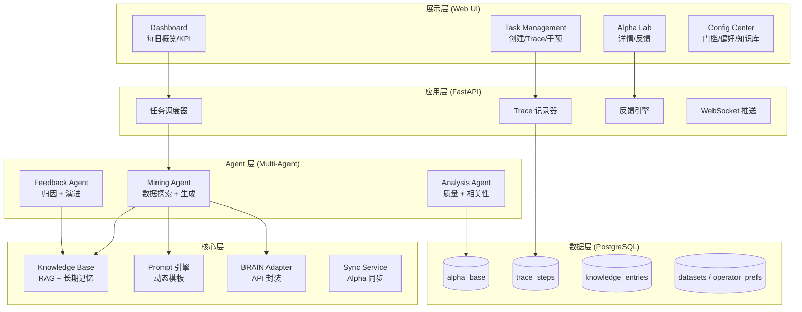
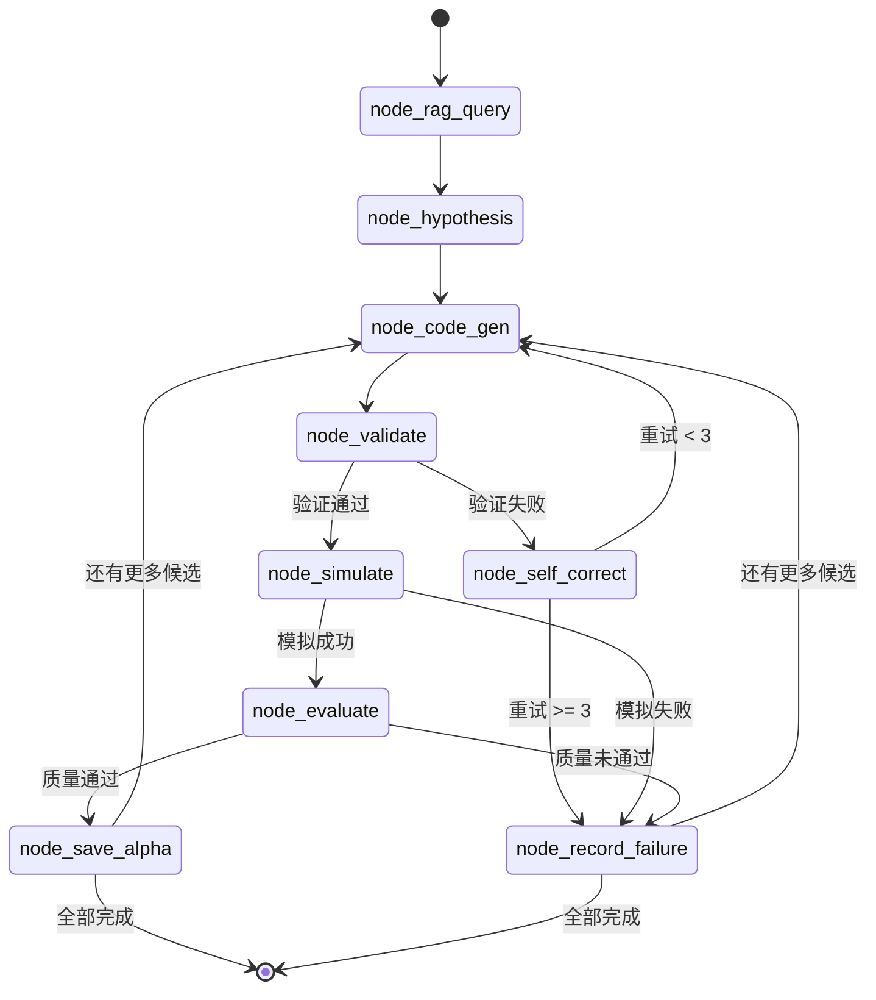
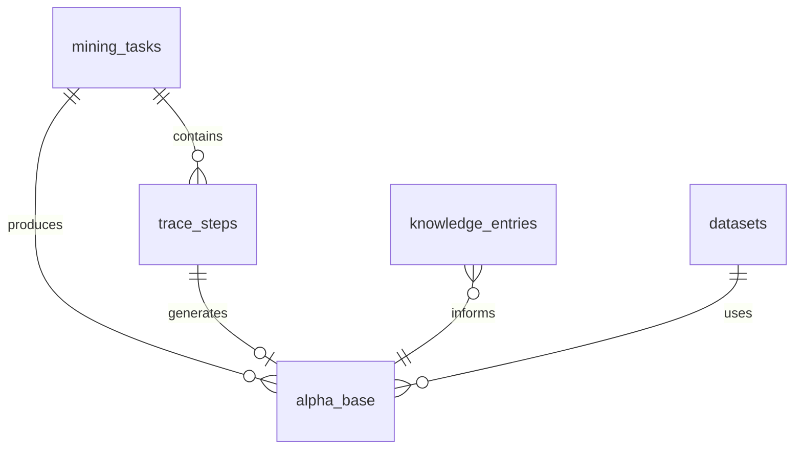
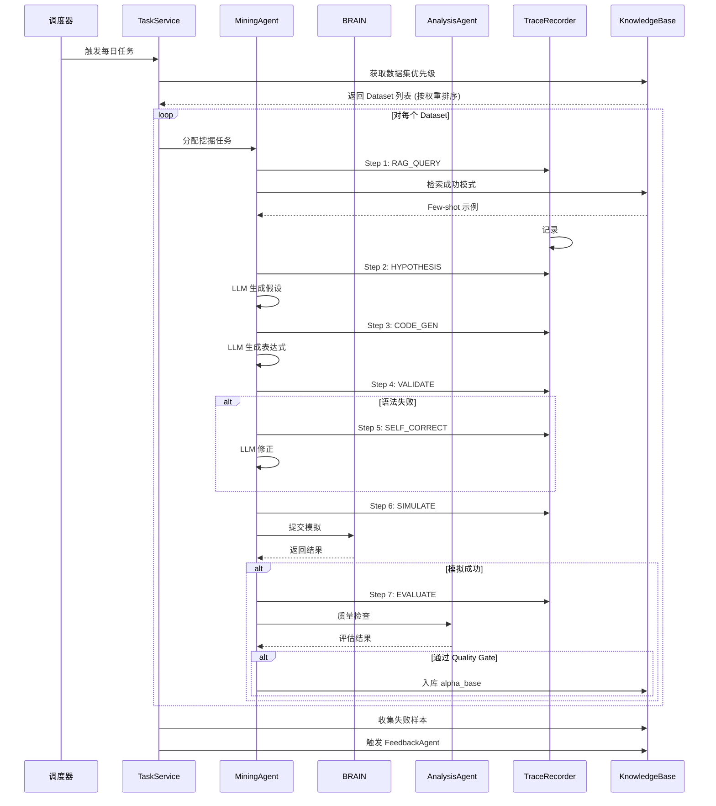
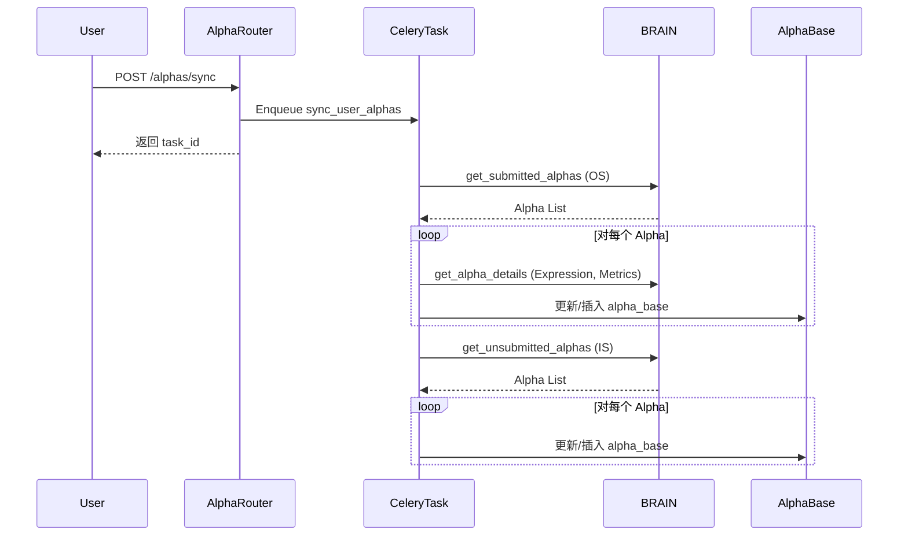
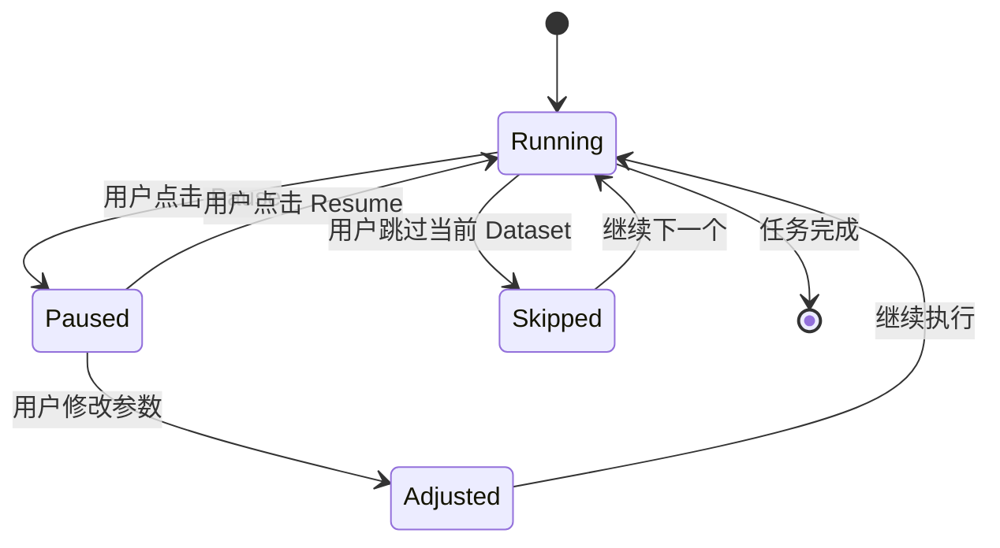

# AIAC 2.0 (AIACV2): 详细设计说明文档

**版本**：v2.0  
**日期**：2026-01-24  
**依赖文档**：需求说明文档 v2.0  
**设计理念**：Alpha-GPT + RD-Agent CoSTEER

---

## 1. 系统架构设计

系统采用 **模块化单体 (Modular Monolith)** 架构，深度融合 Alpha-GPT 的交互范式与 RD-Agent 的 CoSTEER 反馈闭环。

### 1.1 分层架构



### 1.2 核心模块职责

| 模块 | 职责 | 技术实现 |
|------|------|---------|
| **Web UI** | 人机交互界面，Trace 可视化，人工干预 | React + Ant Design + Recharts |
| **Task Scheduler** | 每日计划生成，任务分发 | Celery Beat |
| **Trace Recorder** | 记录每个挖掘步骤，支持回放 | PostgreSQL + WebSocket |
| **Agent Hub** | 协调 Mining/Analysis/Feedback Agent | LangGraph / 自研 |
| **Knowledge Base** | 成功模式/失败教训/元数据存储 | PostgreSQL + pgvector |
| **Prompt Engine** | 动态 Prompt 模板，Few-shot 注入 | Jinja2 |
| **BRAIN Adapter** | WorldQuant API 封装，限流，重试 | httpx + backoff |
| **Sync Service** | 定期同步 Brain 平台现有 Alpha 数据 | Celery Task |

---

## 2. Agent 设计详情

### 2.1 Mining Agent (LangGraph 架构)

**职责**: 数据探索 + Alpha 表达式生成

Mining Agent 采用 **LangGraph StateGraph** 架构重构，实现高内聚低耦合、全程可追踪的工作流。

---

#### 2.1.1 架构设计原则

| 原则 | 实现方式 |
|------|---------|
| **强类型状态** | Pydantic `MiningState` 模型，编译时类型检查 |
| **纯函数节点** | 每个节点无副作用，接收 state 返回 partial update |
| **条件边路由** | 基于状态字段的声明式分支逻辑 |
| **服务层解耦** | LLM/Trace/RAG 服务独立封装 |
| **结构化日志** | `structlog` 绑定 `task_id`, `alpha_index` |

---

#### 2.1.2 目录结构

```
backend/agents/
├── services/
│   ├── llm_service.py     # LLM 调用统一接口
│   ├── trace_service.py   # Trace 记录服务
│   └── rag_service.py     # 知识库检索服务
├── graph/
│   ├── state.py           # MiningState 状态定义
│   ├── nodes.py           # 9 个纯函数节点
│   ├── edges.py           # 5 个条件路由函数
│   └── workflow.py        # StateGraph 编排
└── mining_agent.py        # 高层入口
```

---

#### 2.1.3 状态模型 (`MiningState`)

```python
class MiningState(BaseModel):
    """LangGraph 图状态"""
    # 任务上下文
    task_id: int
    region: str
    universe: str
    target_count: int
    
    # RAG 结果
    success_patterns: List[str] = []
    failure_pitfalls: List[str] = []
    
    # 当前 Alpha 处理
    current_alpha_index: int = 0
    candidates: List[AlphaCandidate] = []
    
    # 验证状态
    validation_error: Optional[str] = None
    self_correct_attempts: int = 0
    max_self_correct: int = 3
    
    # 模拟结果
    simulation_result: Optional[Dict[str, Any]] = None
    simulation_error: Optional[str] = None
    
    # 评估结果
    quality_passed: bool = False
    quality_reason: Optional[str] = None
    
    # 最终输出
    successful_alphas: List[AlphaResult] = []
    failed_records: List[FailureRecord] = []
    trace_steps: List[TraceStepData] = []
```

---

#### 2.1.4 节点定义 (9 个)

| 节点 | 职责 | 输入 | 输出更新 |
|------|------|------|---------|
| `node_rag_query` | 检索知识库 | `task_id` | `success_patterns`, `failure_pitfalls` |
| `node_hypothesis` | LLM 生成假设 | patterns, context | `candidates` |
| `node_code_gen` | 生成 Alpha 表达式 | candidates[index] | 更新 candidate.expression |
| `node_validate` | 语法验证 | expression | `validation_error` |
| `node_self_correct` | LLM 修正表达式 | error, expression | 更新 expression, `self_correct_attempts` |
| `node_simulate` | BRAIN 模拟 | expression | `simulation_result`, `simulation_error` |
| `node_evaluate` | 质量评估 | simulation_result | `quality_passed`, `quality_reason` |
| `node_save_alpha` | 持久化成功 Alpha | result | 追加 `successful_alphas` |
| `node_record_failure` | 记录失败原因 | error info | 追加 `failed_records` |

---

#### 2.1.5 条件边路由 (5 个)



**路由函数**:

| 路由 | 条件逻辑 |
|------|---------|
| `route_after_validate` | `validation_error is None` → simulate, else → self_correct |
| `route_after_self_correct` | `attempts < max` → code_gen, else → record_failure |
| `route_after_simulate` | `simulation_error is None` → evaluate, else → record_failure |
| `route_after_evaluate` | `quality_passed` → save_alpha, else → record_failure |
| `route_next_alpha` | `index < len(candidates)` → code_gen, else → END |

---

#### 2.1.6 服务层设计

**LLMService** (`llm_service.py`):
- 统一调用接口，支持 OpenAI 兼容 API
- 自动重试 (3次) + 指数退避
- JSON 响应清洗 (剥离 markdown 代码块)
- Pydantic schema 验证
- Token 计数日志记录

**TraceService** (`trace_service.py`):
- `TraceStepRecord` 数据类封装
- `TraceContext` 上下文管理器自动计时
- 批量写入优化 (延迟到事务结束)
- 与 `trace_steps` 表直接对接

**RAGService** (`rag_service.py`):
- 成功模式检索: 按 region/universe 过滤 + Sharpe 排序
- 失败教训检索: 提取近期高频错误类型
- Dataset 元数据查询

---

#### 2.1.7 示例 Prompt 模板

**假设生成** (`HYPOTHESIS_PROMPT`):
```text
[System]
你是一个世界级的量化研究员。基于给定数据集和字段，挖掘高夏普比率、低换手率的 Alpha 因子。

[Context]
Region: {region}, Universe: {universe}
Dataset: {dataset_desc}
Available Fields: {field_list}
Operators: {operator_list}

[Success Patterns]
{few_shot_examples}

[Failure Pitfalls - 避免这些模式]
{negative_constraints}

[Task]
生成 {n} 个候选假设，输出 JSON:
[{"hypothesis": "...", "target_fields": [...], "suggested_operators": [...]}]
```

**自我修正** (`SELF_CORRECT_PROMPT`):
```text
[Error]
{error_message}

[Original Expression]
{original_expression}

[Task]
修正上述表达式，仅输出修正后的表达式，无其他文字。
```

### 2.2 Analysis Agent

**职责**: 质量评估 + 相关性检查

**Quality Gate 配置**:

```yaml
quality_thresholds:
  sharpe_min: 1.5
  turnover_max: 0.7
  fitness_min: 0.6
  returns_min: 0.0
  max_dd_max: 0.3

diversity_thresholds:
  max_correlation: 0.7  # 与现有 Alpha 相关性
```

**异常检测**:
- Sharpe > 5.0 → 警告：可能数据错误
- Turnover > 1.5 → 警告：过度交易

### 2.3 Feedback Agent

**职责**: 失败归因 + 知识库演进

**归因规则**:

| 错误类型 | 识别条件 | 处理动作 |
|---------|---------|---------|
| `FIELD_NOT_FOUND` | 模拟报错含字段名 | 加入 field_blacklist |
| `SYNTAX_ERROR` | 解析失败 | 提取模式，加入负向约束 |
| `NAN_OVERFLOW` | 结果全 NaN | 标记该 Dataset 风险 |
| `PERF_LOW` | Sharpe < 阈值 | 降低该 Dataset 权重 |
| `HIGH_CORRELATION` | corr > 0.7 | 记录重复模式 |

**演进周期**: 每日任务结束后自动执行

---

## 3. 数据库设计

### 3.1 核心表结构

```sql
-- =====================
-- 任务与追踪
-- =====================

-- 挖掘任务表
CREATE TABLE mining_tasks (
    id SERIAL PRIMARY KEY,
    task_name VARCHAR(255) NOT NULL,
    region VARCHAR(50) NOT NULL,
    universe VARCHAR(100) NOT NULL,
    dataset_strategy VARCHAR(50) DEFAULT 'AUTO',
    agent_mode VARCHAR(50) DEFAULT 'AUTONOMOUS',
    status VARCHAR(50) DEFAULT 'PENDING',
    daily_goal INTEGER DEFAULT 4,
    progress_current INTEGER DEFAULT 0,
    config JSONB,
    created_at TIMESTAMP DEFAULT NOW(),
    updated_at TIMESTAMP DEFAULT NOW()
);

-- Trace 步骤表 (RD-Agent 核心)
CREATE TABLE trace_steps (
    id SERIAL PRIMARY KEY,
    task_id INTEGER REFERENCES mining_tasks(id),
    step_type VARCHAR(50) NOT NULL,
    -- RAG_QUERY | HYPOTHESIS | CODE_GEN | VALIDATE | SIMULATE | SELF_CORRECT | EVALUATE
    step_order INTEGER NOT NULL,
    input_data JSONB,
    output_data JSONB,
    duration_ms INTEGER,
    status VARCHAR(50),  -- SUCCESS | FAILED | SKIPPED
    error_message TEXT,
    created_at TIMESTAMP DEFAULT NOW()
);

-- =====================
-- Alpha 仓库
-- =====================

CREATE TABLE alpha_base (
    id SERIAL PRIMARY KEY,
    task_id INTEGER REFERENCES mining_tasks(id),
    trace_step_id INTEGER REFERENCES trace_steps(id),
    alpha_id VARCHAR(100) UNIQUE,
    expression TEXT NOT NULL,
    hypothesis TEXT,
    logic_explanation TEXT,

    -- 元数据
    region VARCHAR(50),
    universe VARCHAR(100),
    dataset_id VARCHAR(100),
    fields_used TEXT[],
    operators_used TEXT[],

    -- 状态
    simulation_status VARCHAR(50),
    quality_status VARCHAR(50),
    diversity_status VARCHAR(50),
    human_feedback VARCHAR(50) DEFAULT 'NONE',
    feedback_comment TEXT,

    -- 性能指标
    metrics JSONB,
    pnl_data JSONB,

    created_at TIMESTAMP DEFAULT NOW()
);

CREATE INDEX idx_alpha_region ON alpha_base(region);
CREATE INDEX idx_alpha_status ON alpha_base(quality_status);

-- =====================
-- 知识库
-- =====================

CREATE TABLE knowledge_entries (
    id SERIAL PRIMARY KEY,
    entry_type VARCHAR(50) NOT NULL,
    -- SUCCESS_PATTERN | FAILURE_PITFALL | FIELD_BLACKLIST | OPERATOR_STAT
    pattern TEXT,
    metadata JSONB,
    is_active BOOLEAN DEFAULT TRUE,
    usage_count INTEGER DEFAULT 0,
    created_by VARCHAR(50) DEFAULT 'SYSTEM',
    created_at TIMESTAMP DEFAULT NOW(),
    updated_at TIMESTAMP DEFAULT NOW()
);

-- =====================
-- 元数据
-- =====================

CREATE TABLE datasets (
    dataset_id VARCHAR(100) PRIMARY KEY,
    region VARCHAR(50),
    category VARCHAR(100),
    subcategory VARCHAR(100),
    description TEXT,
    field_count INTEGER,
    alpha_success_count INTEGER DEFAULT 0,
    alpha_fail_count INTEGER DEFAULT 0,
    mining_weight FLOAT DEFAULT 1.0,
    last_synced_at TIMESTAMP
);

CREATE TABLE operator_prefs (
    operator_name VARCHAR(100) PRIMARY KEY,
    status VARCHAR(50) DEFAULT 'ACTIVE',
    usage_count INTEGER DEFAULT 0,
    success_count INTEGER DEFAULT 0,
    failure_rate FLOAT DEFAULT 0.0,
    updated_at TIMESTAMP DEFAULT NOW()
);
```

### 3.2 ER 图



---

## 4. API 接口设计

Base Path: `/api/v1`

### 4.1 Dashboard

| Method | Endpoint | Description | Response |
|--------|----------|-------------|----------|
| GET | `/stats/daily` | 今日挖掘概览 | `{goal, current, success_rate, avg_sharpe}` |
| GET | `/stats/live-feed` | SSE 实时活动流 | Server-Sent Events |

### 4.2 Tasks

| Method | Endpoint | Description | Payload/Response |
|--------|----------|-------------|------------------|
| POST | `/tasks` | 创建任务 | `{name, region, universe, strategy, mode}` |
| GET | `/tasks` | 任务列表 | `[{id, name, status, progress}]` |
| GET | `/tasks/{id}` | 任务详情 | `{...task, trace_summary}` |
| GET | `/tasks/{id}/trace` | 完整 Trace | `[{step_type, input, output, status}]` |
| POST | `/tasks/{id}/intervene` | 人工干预 | `{action: PAUSE|RESUME|SKIP|ADJUST}` |

### 4.3 Alphas

| Method | Endpoint | Description |
|--------|----------|-------------|
| GET | `/alphas` | Alpha 列表 (分页+过滤) |
| POST | `/alphas/sync` | 触发全量 Alpha 同步 |
| GET | `/alphas/{id}` | Alpha 详情 + PnL |
| POST | `/alphas/{id}/feedback` | 提交反馈 `{rating, comment}` |

### 4.4 Knowledge

| Method | Endpoint | Description |
|--------|----------|-------------|
| GET | `/knowledge` | 知识库列表 |
| GET | `/knowledge/success-patterns` | 成功模式 |
| GET | `/knowledge/failure-pitfalls` | 失败教训 |
| PUT | `/knowledge/{id}` | 更新条目 |
| DELETE | `/knowledge/{id}` | 删除条目 |

### 4.5 Config

| Method | Endpoint | Description |
|--------|----------|-------------|
| GET | `/config` | 获取所有配置 |
| PUT | `/config/thresholds` | 更新质量门槛 |
| PUT | `/config/operators` | 更新算子偏好 |
| PUT | `/config/datasets` | 更新数据集权重 |

---

## 5. 关键流程详细设计

### 5.1 每日挖掘流程



### 5.2 Alpha 同步流程 (Sync)



### 5.2 人工干预流程



---

## 6. 技术栈选型

| 层级 | 技术 | 版本 | 理由 |
|------|------|------|------|
| **后端** | FastAPI | 0.100+ | 高性能 + OpenAPI |
| **任务队列** | Celery | 5.x | 异步任务 + Beat 调度 |
| **前端** | React + Vite | 18.x | 现代化构建 |
| **UI 组件** | Ant Design | 5.x | 企业级组件 |
| **图表** | Recharts | 2.x | React 原生 |
| **代码编辑** | Monaco Editor | — | VS Code 内核 |
| **数据库** | PostgreSQL | 15+ | JSONB + 事务 |
| **缓存** | Redis | 7.x | 队列 + SSE pub/sub |
| **容器** | Docker Compose | — | 一键部署 |
| **LLM** | LiteLLM | — | 多模型切换 |

---

## 7. 实施计划

| 阶段 | 任务 | 预计工时 |
|------|------|---------|
| **Phase 1** | 后端骨架 + DB 迁移 | 3 天 |
| **Phase 2** | Mining Agent 实现 | 3 天 |
| **Phase 3** | Trace 系统 + WebSocket | 2 天 |
| **Phase 4** | 前端 Dashboard + Task | 4 天 |
| **Phase 5** | Feedback Loop 实现 | 2 天 |
| **Phase 6** | 联调 + 测试 | 3 天 |
| **Total** | — | **17 天** |

---

## 8. 附录：UI 设计规范

详见 [ui_design_spec.md](./ui_design_spec.md)

### 8.1 设计原则

- **主题**: Future FinTech 深色模式
- **强调色**: Cyan (AI 活动) / Green (收益) / Red (风险)
- **布局**: Glassmorphism 卡片 + 可折叠侧边栏
- **实时性**: LLM 思考过程流式输出

### 8.2 关键 UI 组件

| 组件 | 用途 |
|------|------|
| **Trace Timeline** | 展示挖掘步骤竖向时间线 |
| **Expression Viewer** | Monaco 编辑器，语法高亮 |
| **PnL Chart** | TradingView 风格累积收益曲线 |
| **Live Feed** | 实时活动流 (SSE) |
| **Feedback Modal** | 👍/👎 + 评论输入 |
