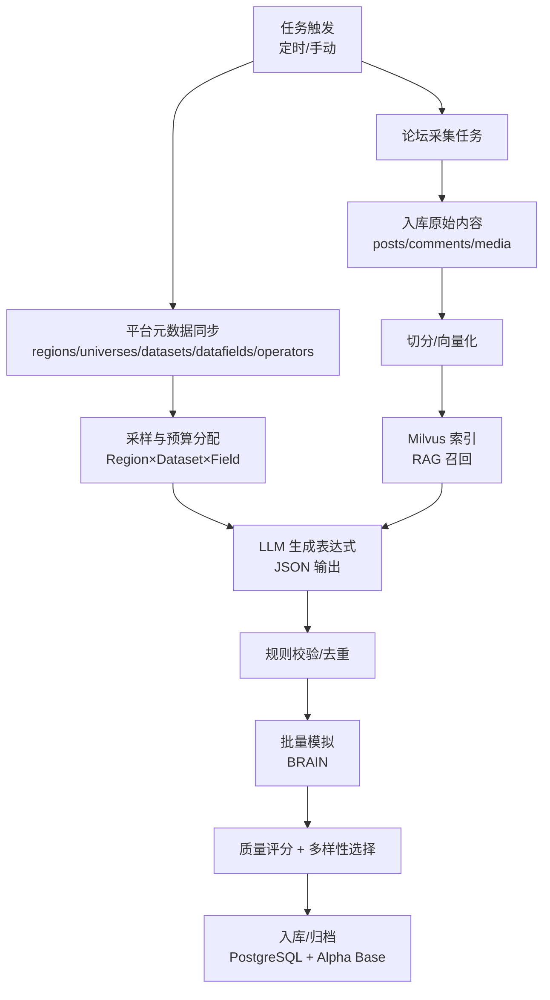

# AIAC 2.0（AIACV2）详细设计说明文档

版本：v0.1  
日期：2026-01-24  
来源：基于 [需求说明文档.md](file:///e:/AIACV2_v1.2/worldquant-alpha-aiac/data/%E9%9C%80%E6%B1%82%E8%AF%B4%E6%98%8E%E6%96%87%E6%A1%A3.md) 与 [create_table.sql](file:///e:/AIACV2_v1.2/worldquant-alpha-aiac/data/create_table.sql)

---

## 1. 设计目标与范围

### 1.1 目标

- 将“探索数据 → 生成表达式 → 校验 → 模拟 → 评分/多样性选择 → 入库/归档”的流程工程化、可追溯、可观察。
- 支撑论坛知识库（PostgreSQL + Milvus + MinIO）用于 RAG，提升 Alpha 挖掘质量与多样性。
- 提供 Web 管理台用于任务编排、数据浏览、RAG 调试与 Alpha 结果对比。

### 1.2 范围边界

- 默认使用 OpenAI 兼容 API；不在本阶段内做自训练/微调。
- Alpha 模拟以 BRAIN 平台为主；后续可扩展 QLib 等其他平台 Adapter。

---

## 2. 总体架构

### 2.1 逻辑分层

- 接入层（UI/API）：Web 管理台、认证、配置管理、任务触发与查询。
- 业务层（核心域）：数据探索、候选采样、表达式生成、校验、模拟、评分与多样性选择。
- 平台层（Adapter）：BRAIN API（datasets/datafields/operators/simulate）、LLM Provider、向量库/对象存储。
- 存储层：PostgreSQL（结构化与原始数据）、Milvus（向量检索）、MinIO（图片/附件）、Redis（缓存）。

### 2.2 关键数据流



---

## 3. 核心模块设计

### 3.1 元数据同步（BRAIN Facts Sync）

**目标**：把“可用设置/数据集/字段/算子”等平台事实落到本地，作为采样、校验、提示词注入的单一真值源，并减少重复请求。

- 同步对象：
  - `regions`、`universes`、`neutralizations`
  - `datasets`、`datafields`
  - `operators`
  - `pyramid_multipliers`（用于探索优先级）
- 存储表：
  - [regions](file:///e:/AIACV2_v1.2/worldquant-alpha-aiac/data/create_table.sql#L221-L237)、[universes](file:///e:/AIACV2_v1.2/worldquant-alpha-aiac/data/create_table.sql#L571-L587)、[neutralizations](file:///e:/AIACV2_v1.2/worldquant-alpha-aiac/data/create_table.sql#L118-L131)
  - [datasets](file:///e:/AIACV2_v1.2/worldquant-alpha-aiac/data/create_table.sql#L32-L60)、[datafields](file:///e:/AIACV2_v1.2/worldquant-alpha-aiac/data/create_table.sql#L508-L531)、[operators](file:///e:/AIACV2_v1.2/worldquant-alpha-aiac/data/create_table.sql#L171-L191)
  - [pyramid_multipliers](file:///e:/AIACV2_v1.2/worldquant-alpha-aiac/data/create_table.sql#L194-L219)
- 缓存策略：热点查询（datasets/datafields/operators）使用 Redis 缓存，避免 UI 与生成任务重复打平台接口。

### 3.2 目标空间生成与采样（Sampler）

**输入**：同步后的 datasets/datafields/operators + 用户配置（region/universe/delay/neutralization/预算/门槛）  
**输出**：采样目标集合 `TargetSpec[]`（每个元素包含 region/universe/delay/dataset/fields 等）

- 预算：
  - 探索预算：候选表达式总数上限
  - 模拟预算：模拟请求总数上限
  - 入库预算：最终入库 3–4
- 分层：按 region → category/subcategory → dataset → field 进行分层覆盖，避免集中于单一 dataset。

### 3.3 表达式生成（LLM）

**目标**：对每个 `TargetSpec` 生成多个候选表达式，并强制结构化输出。

- LLM Provider 配置落库：
  - [llm_providers](file:///e:/AIACV2_v1.2/worldquant-alpha-aiac/data/create_table.sql#L95-L115)：支持多个模型、默认模型、温度/最大 tokens。
- 生成任务落库：
  - [generation_tasks](file:///e:/AIACV2_v1.2/worldquant-alpha-aiac/data/create_table.sql#L70-L92)：记录任务状态、进度、结果与错误信息。
- 输出 JSON（建议字段）：
  - `alpha_expression`、`economic_rationale`
  - `data_fields_used`、`operators_used`
  - `hypothesis`（可选，micro-hypothesis）
  - `settings`（可选：decay/truncation 等覆盖）

### 3.4 规则校验与去重（Gatekeeper）

**目标**：在进入模拟之前，把 LLM 输出的不确定性挡在门外。

- 校验项：
  - 字段存在性：表达式解析后字段必须属于当前 datafields。
  - 算子合法性：算子必须存在于 operators 且 scope 支持 REGULAR。
  - 参数合法性：lookback 为正整数；必要时要求命名参数；向量字段类型与算子匹配。
- 算子黑名单：
  - [operator_blacklist](file:///e:/AIACV2_v1.2/worldquant-alpha-aiac/data/create_table.sql#L151-L168)：自动沉淀高失败算子与错误样式。
- 去重策略：
  - 精确去重：`expression_hash` 唯一（见 alphas 表字段与索引）。
  - 近似去重：字段集合、算子集合、lookback 等维度计算相似度后降权。

### 3.5 模拟与结果入库（Simulator + Store）

- Alpha 主表：
  - [alphas](file:///e:/AIACV2_v1.2/worldquant-alpha-aiac/data/create_table.sql#L384-L506)：覆盖 IS/OS 指标字段、相关性检查结果、状态流转。
- PnL 明细：
  - [alpha_pnl](file:///e:/AIACV2_v1.2/worldquant-alpha-aiac/data/create_table.sql#L1-L13)：用于绘图与长期分析。
- 相关性检查：
  - 将 self/prod 相关性结果写入 `self_corr_result` / `prod_corr_result`（jsonb），并更新 `is_submittable`、`is_all_pass`。

### 3.6 评分与多样性选择（Selector）

**目标**：在通过质量门槛后，做多样性优化选出最终入库集合。

- 质量门槛（示例）：Sharpe/Fitness/Turnover/Drawdown/Returns/Margin 等阈值，可配置化。
- 多样性目标（示例）：
  - dataset 多样性：同日入库不集中于同一 dataset_id
  - 字段集合多样性：Jaccard 相似度上限
  - 算子类别多样性：尽量覆盖不同 category
  - 周期多样性：lookback 分散

### 3.7 运行记录与可观测性

- 操作日志：
  - [operation_logs](file:///e:/AIACV2_v1.2/worldquant-alpha-aiac/data/create_table.sql#L134-L148)：关键动作写入（触发任务/变更配置/手动标记等）。
- 系统配置：
  - [system_configs](file:///e:/AIACV2_v1.2/worldquant-alpha-aiac/data/create_table.sql#L260-L275)：动态配置（门槛、预算、并发、重试等）。
- 认证 Token：
  - [brain_auth_tokens](file:///e:/AIACV2_v1.2/worldquant-alpha-aiac/data/create_table.sql#L16-L29)：缓存 BRAIN 授权信息（避免频繁登录）。
- 凭据：
  - [wqb_credentials](file:///e:/AIACV2_v1.2/worldquant-alpha-aiac/data/create_table.sql#L367-L381)：保存加密后的用户名/密码（如必须）。

---

## 4. 数据库设计（PostgreSQL）

### 4.1 现有表结构分域说明（来自 create_table.sql）

- 平台元数据：
  - datasets / datafields / operators / regions / universes / neutralizations / pyramid_multipliers
- 生成与模板：
  - templates / template_variables / template_datasets / template_evaluations / generation_tasks
- Alpha 结果：
  - alphas / alpha_pnl
- 强化学习探索（可选）：
  - rl_states / rl_actions
- 运维与配置：
  - system_configs / operation_logs / operator_blacklist / brain_auth_tokens / wqb_credentials

### 4.2 论坛原始数据表（需求补充）

需求要求“中文论坛所有原始数据入库（文章/评论/图片/Alpha 表达式等）”。目前需求文档中已出现 `wqb_posts`、`wqb_comments` 的设计，应作为论坛数据的基础结构：

- `wqb_posts`：帖子主体，支持 `json_data` 保存原始 payload
- `wqb_comments`：评论，外键关联 `wqb_posts(id)`

建议在此基础上补齐图片/附件与 Alpha 抽取表，用于 RAG 与结构化挖掘。

#### 建议新增表：wqb_attachments（图片/附件元数据）

```sql
create table if not exists public.wqb_attachments (
  id varchar(255) primary key,
  post_id varchar(255) references public.wqb_posts(id) on delete cascade,
  comment_id varchar(255) references public.wqb_comments(id) on delete cascade,
  media_type varchar(50) not null,
  source_url varchar(2048),
  minio_bucket varchar(255),
  minio_object_key varchar(1024),
  sha256 varchar(64),
  bytes bigint,
  width int,
  height int,
  ocr_text text,
  json_data jsonb,
  created_at timestamp default current_timestamp,
  updated_at timestamp default current_timestamp
);
create index if not exists idx_wqb_attachments_post_id on public.wqb_attachments(post_id);
create index if not exists idx_wqb_attachments_comment_id on public.wqb_attachments(comment_id);
```

#### 建议新增表：wqb_alpha_expressions（Alpha 表达式抽取）

```sql
create table if not exists public.wqb_alpha_expressions (
  id bigserial primary key,
  post_id varchar(255) references public.wqb_posts(id) on delete cascade,
  comment_id varchar(255) references public.wqb_comments(id) on delete cascade,
  expression text not null,
  expression_language varchar(50) default 'FASTEXPR',
  extracted_from varchar(50) not null,
  context_text text,
  confidence numeric(4,3) default 0.500,
  created_at timestamp default current_timestamp
);
create index if not exists idx_wqb_alpha_expr_post_id on public.wqb_alpha_expressions(post_id);
create index if not exists idx_wqb_alpha_expr_comment_id on public.wqb_alpha_expressions(comment_id);
```

#### 建议新增表：rag_chunks（RAG 分块）

```sql
create table if not exists public.rag_chunks (
  id bigserial primary key,
  source_type varchar(50) not null,
  post_id varchar(255) references public.wqb_posts(id) on delete cascade,
  comment_id varchar(255) references public.wqb_comments(id) on delete cascade,
  attachment_id varchar(255) references public.wqb_attachments(id) on delete cascade,
  chunk_index int not null,
  chunk_text text not null,
  chunk_tokens int,
  created_at timestamp default current_timestamp,
  unique (source_type, post_id, comment_id, attachment_id, chunk_index)
);
create index if not exists idx_rag_chunks_post_id on public.rag_chunks(post_id);
create index if not exists idx_rag_chunks_comment_id on public.rag_chunks(comment_id);
```

#### 建议新增表：ingest_jobs（论坛采集与向量构建任务）

```sql
create table if not exists public.ingest_jobs (
  id bigserial primary key,
  job_type varchar(50) not null,
  status varchar(20) not null,
  started_at timestamp,
  finished_at timestamp,
  cursor text,
  stats jsonb,
  error_message text,
  created_at timestamp default current_timestamp
);
create index if not exists idx_ingest_jobs_type_status on public.ingest_jobs(job_type, status);
```

---

## 5. 向量库设计（Milvus）

### 5.1 Collection 设计

- collection：`wqb_forum_collection`
- 向量对象粒度：以 `rag_chunks.id` 为单位（一条 chunk 对应一条向量）
- 主键：`chunk_id`（建议与 `rag_chunks.id` 一致）
- 元数据字段（建议）：
  - `source_type`、`post_id`、`comment_id`、`attachment_id`
  - `url`、`title`、`create_time`、`topic_id`、`topic_name`、`language`
  - `hash`（可选：chunk_text 的 hash，用于幂等写入）

### 5.2 写入与一致性

- `rag_chunks` 先落 PostgreSQL，再异步写入 Milvus
- 增量更新：以 `post_id/comment_id/attachment_id` 的更新时间或 `ingest_jobs.cursor` 驱动
- 删除策略：帖子/评论删除时，先删 Milvus 中对应 chunk，再删 PostgreSQL（或采用异步补偿任务）

### 5.3 召回与过滤

- 向量召回 topK + 结构化过滤（topic、时间范围、source_type）
- RAG 调试页需要返回：命中 chunk 列表、chunk_text、相似度分数、来源链接

---

## 6. 对象存储设计（MinIO）

- 仅存图片/附件二进制本体；元数据落 PostgreSQL（wqb_attachments）
- bucket：`wqb-forum-media`
- 对象 Key（建议）：`wqb_forum/{post_id}/{sha256}.{ext}`
- 上传流程：
  1) 下载论坛图片 → 计算 sha256 → 上传 MinIO → 写入 wqb_attachments
  2) OCR（可选）生成 `ocr_text`，并参与 RAG 分块

---

## 7. 缓存设计（Redis）

- 缓存对象：
  - datasets 列表、datafields 列表、operators 列表
  - 平台设置选项（region/universe/neutralization/delay）
- 失效策略：
  - 定时刷新（例如 12h）
  - 手动刷新（UI 提供“强制刷新”按钮）

---

## 8. Web API 设计（供 UI 调用）

### 8.1 认证与权限

- 目标：管理台访问需要登录；最小权限模型（管理员/只读）。
- 方案：Session/JWT 均可；凭据不写入日志。

### 8.2 资源与接口（建议）

- 配置
  - `GET /api/configs`：读取系统配置（system_configs）
  - `PUT /api/configs`：更新系统配置（写 operation_logs）
- 平台元数据
  - `POST /api/sync/platform`：触发同步任务
  - `GET /api/datasets`、`GET /api/datafields`、`GET /api/operators`
- 论坛内容
  - `POST /api/forum/ingest`：触发采集（写 ingest_jobs）
  - `GET /api/forum/posts`、`GET /api/forum/posts/{id}`
  - `GET /api/forum/posts/{id}/comments`
- RAG
  - `POST /api/rag/build`：触发分块/向量构建
  - `POST /api/rag/search`：召回调试（返回 chunks + 分数 + 来源）
- Alpha 生成与回测
  - `POST /api/alpha/generate`：触发 generation_tasks
  - `GET /api/alpha/tasks/{task_id}`：查询进度与结果
  - `GET /api/alphas`、`GET /api/alphas/{id}`：结果浏览与对比

---

## 9. UI 详细设计（Web 管理台）

### 9.1 信息架构（IA）

- 首页/仪表盘：今日产出、任务状态、失败 TopN、入库 Alpha 概览
- 数据源管理：论坛采集配置、连接测试、限流/代理
- 采集任务：任务列表、日志、失败重试、增量游标
- 内容浏览：帖子列表、帖子详情（正文/评论树/图片）、搜索过滤
- Alpha 抽取：抽取列表、表达式详情、去重合并预览、导出
- 知识库（RAG）：分块预览、构建状态、召回调试、重建/增量
- 生成与回测：生成任务配置、候选列表、批量回测、失败原因与修复建议
- 结果与分析：单 Alpha 指标、组合对比、历史趋势
- 系统设置：模型配置、API Key/凭据管理、预算与门槛、告警（可选）

### 9.2 关键交互

- 任务编排：用户选择 region/universe/dataset 策略与预算 → 创建生成任务 → 实时查看进度 → 查看候选与入库决策
- RAG 调试：输入 query → 查看命中文档 chunks 与来源 → 一键“用本次召回做生成”绑定到生成任务
- 内容审核：帖子/评论内的 Alpha 表达式高亮展示 → 手动标记“高质量/低质量”用于后续选择策略

---

## 10. 状态机与任务模型

### 10.1 generation_tasks 状态流

- `pending` → `running` → `success|failed`
- `progress`/`completed_items` 用于 UI 进度条
- `result` 结构建议：
  - 输入 TargetSpec 列表、候选表达式列表、模拟结果摘要、入库决策与原因、失败归因统计

### 10.2 alphas 状态流（建议）

- `created`（已生成未模拟）
- `simulated`（模拟完成）
- `evaluated`（评分完成）
- `selected`（入库/归档）
- `submitted`（已提交，若支持提交流）

---

## 11. 安全性与合规

- 任何密码/API Key 不进入需求/设计文档明文；仅以环境变量或加密字段保存（llm_providers.api_key_encrypted、wqb_credentials）。
- 日志脱敏：operation_logs/details 禁止写入密钥与 Cookie。
- 访问控制：管理台最小权限；只读账号不允许触发写操作（采集/生成/重建索引）。
