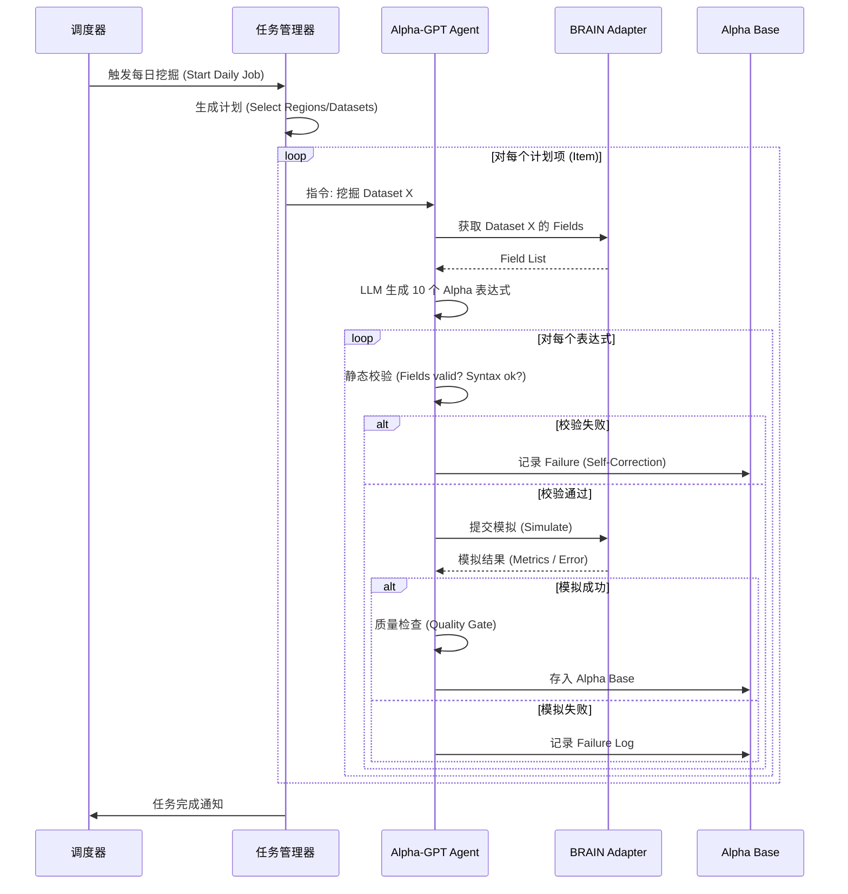

# AIAC 2.0 (AIACV2): 详细设计说明文档

**版本**：v1.0
**日期**：2026-01-24
**依赖文档**：需求说明文档 v1.0

---

## 1. 系统架构设计

系统采用 **模块化单体 (Modular Monolith)** 架构，便于开发维护，同时支持未来拆分为微服务。

### 1.1 分层架构 (Layered Architecture)

```mermaid
graph TD
    User[用户 (Researcher)] --> |Web UI| Frontend[前端 (React/Vue)]
    Frontend --> |REST API| API_Layer[API 网关层 (FastAPI)]
    
    subgraph Backend [后端服务]
        API_Layer --> App_Service[应用服务层 (Application Service)]
        
        subgraph Domain [核心领域层]
            Mining_Context[挖掘上下文]
            Analysis_Context[分析上下文]
            User_Context[用户上下文]
        end
        
        App_Service --> Domain
        App_Service --> Agents[Agent 编排层]
        
        Agents --> Mining_Agent[Mining Agent]
        Agents --> Analysis_Agent[Analysis Agent]
        
        Domain --> Infra[基础设施层]
    end
    
    subgraph Infrastructure [基础设施]
        Infra --> DB[(PostgreSQL)]
        Infra --> VectorDB[(Milvus/Chroma)]
        Infra --> BRAIN_Adapter[WorldQuant BRAIN Adapter]
        Infra --> LLM_Adapter[LLM Adapter (OpenAI/Anthropic)]
    end
```

### 1.2 核心模块划分

| 模块 | 职责 |
| :--- | :--- |
| **Web UI** | 提供 Dashboard、任务管理、Alpha 分析界面。 |
| **API Server** | 处理 HTTP 请求，权限认证，数据DTO转换。 |
| **Mining Core** | 核心挖掘逻辑，预算管理，任务调度。 |
| **Agent Hub** | 封装 LLM 交互逻辑，维护 Prompt 模板，管理 Context。 |
| **Data Engine** | 负责元数据同步 (Datasets/Fields)，本地缓存，向量检索 (RAG)。 |
| **Execution Engine** | 负责与 BRAIN 交互 (Simulation, Submission)，处理限流和重试。 |
| **Feedback System** | 收集运行日志，分析失败原因，更新知识库。 |

---

## 2. 数据库设计 (Database Schema)

使用 **PostgreSQL** 作为主数据库。

### 2.1 核心表结构

#### 2.1.1 任务相关 (Tasks & Jobs)

```sql
-- 挖掘任务表
CREATE TABLE mining_tasks (
    id SERIAL PRIMARY KEY,
    task_name VARCHAR(255) NOT NULL,
    region VARCHAR(50) NOT NULL,
    universe VARCHAR(100) NOT NULL,
    target_dataset_id VARCHAR(100), -- 目标数据集，若为NULL则自动探索
    status VARCHAR(50) DEFAULT 'PENDING', -- PENDING, RUNNING, COMPLETED, FAILED
    config JSONB, -- 具体的挖掘配置 (budget, thresholds)
    created_at TIMESTAMP DEFAULT NOW(),
    updated_at TIMESTAMP DEFAULT NOW()
);

-- 具体的执行 Job (对应一次独立的挖掘尝试)
CREATE TABLE mining_jobs (
    id SERIAL PRIMARY KEY,
    task_id INTEGER REFERENCES mining_tasks(id),
    dataset_id VARCHAR(100),
    datafield_list TEXT[], -- 本次使用的字段列表
    agent_version VARCHAR(50), -- 使用的 Agent/Prompt 版本
    status VARCHAR(50),
    result_summary JSONB, -- { "generated": 10, "simulated": 5, "passed": 1 }
    error_log TEXT,
    created_at TIMESTAMP DEFAULT NOW()
);
```

#### 2.1.2 Alpha 相关 (Assets)

```sql
-- Alpha 仓库表
CREATE TABLE alpha_base (
    id SERIAL PRIMARY KEY,
    job_id INTEGER REFERENCES mining_jobs(id),
    alpha_id VARCHAR(100) UNIQUE, -- BRAIN 返回的 ID
    expression TEXT NOT NULL,
    description TEXT,
    logic_explanation TEXT, -- LLM 生成的逻辑解释
    
    -- 元数据
    region VARCHAR(50),
    universe VARCHAR(100),
    dataset_id VARCHAR(100),
    fields_used TEXT[],
    operators_used TEXT[],
    
    -- 状态
    simulation_status VARCHAR(50), -- SUCCESS, FAILED
    quality_status VARCHAR(50), -- PASS, REJECT
    diversity_status VARCHAR(50), -- PASS, DUPLICATE
    
    -- 性能指标 (JSONB 便于扩展)
    metrics JSONB, -- { "sharpe": 1.5, "turnover": 0.5, "returns": 0.1 }
    
    created_at TIMESTAMP DEFAULT NOW()
);

-- Alpha 失败记录 (用于反馈闭环)
CREATE TABLE alpha_failures (
    id SERIAL PRIMARY KEY,
    job_id INTEGER REFERENCES mining_jobs(id),
    expression TEXT,
    error_type VARCHAR(100), -- SYNTAX_ERROR, FIELD_NOT_FOUND, TIMEOUT
    error_message TEXT,
    raw_response TEXT,
    created_at TIMESTAMP DEFAULT NOW()
);
```

#### 2.1.3 元数据相关 (Metadata)

```sql
-- 数据集元数据
CREATE TABLE datasets (
    dataset_id VARCHAR(100) PRIMARY KEY,
    region VARCHAR(50),
    description TEXT,
    field_count INTEGER,
    alpha_count INTEGER, -- 被引用次数
    coverage FLOAT,
    last_synced_at TIMESTAMP
);

-- 算子黑名单/偏好
CREATE TABLE operator_prefs (
    operator_name VARCHAR(100) PRIMARY KEY,
    status VARCHAR(50), -- ACTIVE, BANNED, DEPRECATED
    failure_rate FLOAT DEFAULT 0.0,
    updated_at TIMESTAMP
);
```

---

## 3. 接口设计 (API Design)

API 遵循 RESTful 规范，BasePath: `/api/v1`

| Method | Endpoint | Description |
| :--- | :--- | :--- |
| **Dashboard** | | |
| GET | `/stats/daily` | 获取今日挖掘概览数据 (Total, Passed, Quality Dist) |
| GET | `/tasks/active` | 获取当前正在运行的任务 |
| **Tasks** | | |
| POST | `/tasks` | 创建新的挖掘任务 (Config payload) |
| GET | `/tasks/{id}` | 获取任务详情 |
| POST | `/tasks/{id}/stop` | 停止任务 |
| **Alphas** | | |
| GET | `/alphas` | 查询 Alpha 列表 (Filters: region, status, metrics) |
| GET | `/alphas/{id}` | 获取 Alpha 详情（含 PnL 图表数据） |
| POST | `/alphas/{id}/feedback` | 人工反馈 (Like/Dislike) |
| **Metadata** | | |
| GET | `/datasets` | 获取可用数据集列表 |
| POST | `/settings/blacklist` | 更新黑名单配置 |

---

## 4. 关键流程详细设计 (Workflows)

### 4.1 每日挖掘流程 (Daily Mining Loop)



### 4.2 反馈闭环 (Feedback Loop)

该流程由 **Feedback Agent** 定期（或任务结束后）执行：

1.  **Extract**: 从 `alpha_failures` 表中提取今日失败样本。
2.  **Cluster**: 将错误按类型聚类（例如：80% 错误是因为某个特定 Dataset 字段不存在）。
3.  **Analyze**:
    *   如果是 **Field Missing**: 将该 Field 加入 `field_blacklist`。
    *   如果是 **Syntax Error**: 提取错误 Pattern，添加到 Prompt 的 "Negative Constraints" 中。
    *   如果是 **Performance Low**: 分析是否是该 Dataset 本身 Alpha 饱和，降低该 Dataset 明日的挖掘权重。
4.  **Update**: 更新 `system_config` 和 `prompt_templates`。

---

## 5. Agent 设计详情

### 5.1 Mining Agent Prompt 结构

```
[System]
你是一个世界级的量化研究员。你的任务是基于给定的数据集和字段，挖掘具有高夏普比率和低换手率的 Alpha 因子。

[Context]
Region: {region}
Universe: {universe}
Dataset: {dataset_desc}
Available Fields: {field_list}
Operators: {operator_list}

[Constraints]
1. 必须符合 BRAIN 平台语法。
2. 禁止使用未来数据。
3. 换手率需 < 0.7。
4. 表达式尽量简洁，避免过度拟合。
5. {negative_constraints} (动态注入的避坑指南)

[Few-Shot Examples]
Input: 动量策略
Output: ts_rank(close, 10) ...
Reasoning: ...

[Task]
请生成 {n} 个候选 Alpha，并提供逻辑解释。
输出格式：JSON List
```

### 5.2 Analysis Agent 职责
*   **Result Verification**: 二次验证模拟结果是否异常（如 Sharpe > 5.0 可能是数据错误）。
*   **Correlation Check**: 调用 `ace.check_correlation` 检查与现有 Top Alpha 的相关性。
*   **Report Generation**: 每日生成 Markdown 格式的挖掘日报。

---

## 6. 技术栈选型

*   **开发语言**: Python 3.10+
*   **后端框架**: FastAPI (高性能 API), Celery (异步任务队列)
*   **前端框架**: React + Ant Design / Vue3 + Element Plus
*   **数据库**: PostgreSQL (主库), Redis (缓存/队列), Milvus (可选，用于知识库 RAG)
*   **LLM 接入**: OpenAI API 兼容接口 (DeepSeek, GPT-4)
*   **部署**: Docker Compose

---

## 7. 实施计划摘要 (Implementation Brief)

1.  **初始化**: 搭建 FastAPI 项目骨架，配置 Postgres。
2.  **核心迁移**: 将现有的脚本逻辑迁移为 Service 类 (MiningService, SimulationService)。
3.  **API 开发**: 暴露 REST 接口。
4.  **Agent 升级**: 实现带 Feedback 的高级 Mining Agent。
5.  **前端开发**: 开发 Dashboard 和配置页。
6.  **联调测试**: 端到端跑通每日自动挖掘流程。
