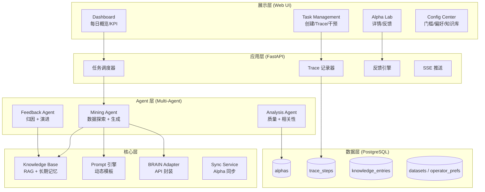
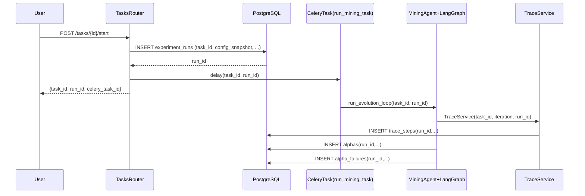
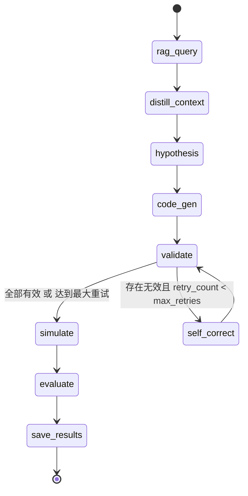
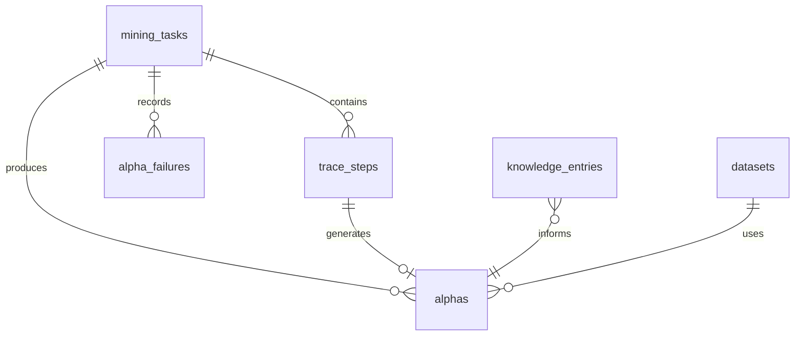
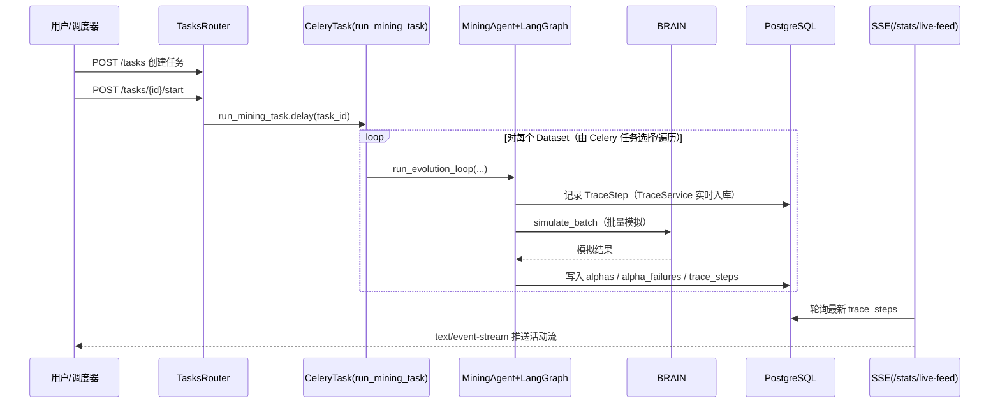
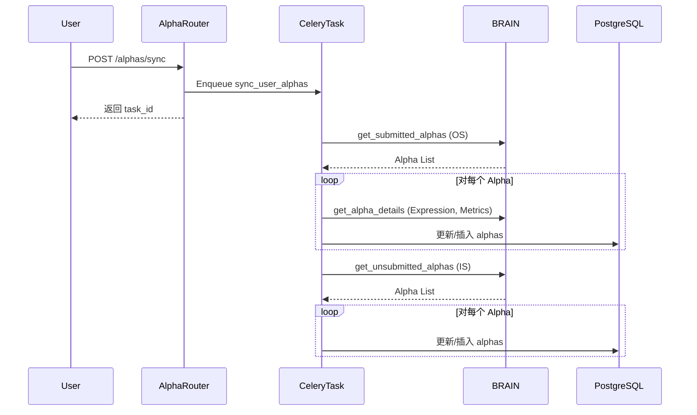
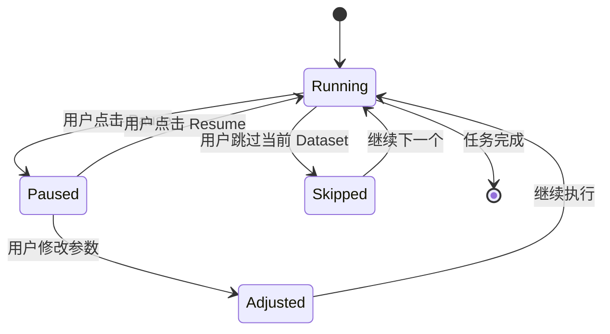

# AIAC 2.0 (AIACV2): 详细设计说明文档

**版本**：v2.0  
**日期**：2026-01-24  
**依赖文档**：需求说明文档 v2.0  
**设计理念**：Alpha-GPT + RD-Agent CoSTEER

---

## 1. 系统架构设计

系统采用 **模块化单体 (Modular Monolith)** 架构，深度融合 Alpha-GPT 的交互范式与 RD-Agent 的 CoSTEER 反馈闭环。

### 1.1 分层架构



### 1.2 核心模块职责

| 模块 | 职责 | 技术实现 |
|------|------|---------|
| **Web UI** | 人机交互界面，Trace 可视化，人工干预 | React + Ant Design + Recharts |
| **Task Scheduler** | 每日计划生成，任务分发 | Celery Beat |
| **Trace Recorder** | 记录每个挖掘步骤，支持回放 | PostgreSQL + SSE (轮询 TraceStep) |
| **Agent Hub** | 协调 Mining/Analysis/Feedback Agent | LangGraph / 自研 |
| **Knowledge Base** | 成功模式/失败教训/元数据存储 | PostgreSQL (knowledge_entries) |
| **Prompt Engine** | Prompt 构建与模板注册 | Python Prompt Builders (backend/agents/prompts.py) |
| **BRAIN Adapter** | WorldQuant API 封装，限流，重试 | httpx + tenacity |
| **Sync Service** | 定期同步 Brain 平台现有 Alpha 数据 | Celery Task |

---

## 2. v2.1 方法论补强（论文方法论 + Alpha-GPT + RD-Agent）

本章节用于将系统从“流程可跑”升级为“**研究严谨 + 闭环自增强 + 可复现可审计**”。

### 2.1 设计目标与约束（Objective & Constraints）

- **目标函数**: 在可实施约束下最大化风险调整收益，同时显式惩罚复杂度与重复度。
- **稳健性**: 必须在时间分段/市场状态分层下保持一致性。
- **可实施性**: 交易成本与换手影响应进入评分体系，而不仅是展示指标。
- **多样性**: 引入与历史/产线/同批候选的相关性与去重约束。
- **可复现**: 每次挖掘必须具备可回放的配置快照与证据链。

### 2.2 工件（Artifact）与证据链模型（RD-Agent 风格）

- **Task**: 任务级容器（对应 `mining_tasks`）。
- **Run/Experiment**: 一次可复现实验运行（建议新增 run 维度，用于绑定配置、prompt 版本、阈值版本）。
- **Decision Record**: 每轮策略决策记录（为何选数据集/算子/阈值/停止条件）。
- **Alpha Artifact**: 入库 Alpha 实体（对应 `alphas`），需可追溯到 Run 与 Trace。
- **TraceStep**: 过程日志（对应 `trace_steps`），用于回放与审计，但不替代 Run 级工件。

#### 2.2.1 Run/Experiment 最小落地（DB 级）

v2.1 建议引入 `experiment_runs`（或 `mining_runs`）表作为“实验运行”的一等公民，用于承载可复现快照与审计信息。

**建议表结构（最小版）**:

```sql
CREATE TABLE experiment_runs (
    id SERIAL PRIMARY KEY,
    task_id INTEGER NOT NULL REFERENCES mining_tasks(id),

    status VARCHAR(50) DEFAULT 'RUNNING',
    trigger_source VARCHAR(50) DEFAULT 'API',
    celery_task_id VARCHAR(100),

    config_snapshot JSONB DEFAULT '{}'::jsonb,
    prompt_version VARCHAR(100),
    thresholds_version VARCHAR(100),
    strategy_snapshot JSONB DEFAULT '{}'::jsonb,

    started_at TIMESTAMP DEFAULT NOW(),
    finished_at TIMESTAMP,
    error_message TEXT
);

CREATE INDEX idx_experiment_runs_task_started ON experiment_runs(task_id, started_at DESC);
```

#### 2.2.2 run_id 在现有表中的贯穿（最小字段变更）

为保证“可追溯”，建议新增 `run_id` 外键（或至少冗余字段）:

- `trace_steps.run_id`（每条 Trace 步骤属于某次 Run）
- `alphas.run_id`（每个 Alpha 产物属于某次 Run）
- `alpha_failures.run_id`（失败样本也必须归属 Run，便于归因统计与复盘）

对应的好处:

- 支持按 `run_id` 回放一次完整实验（Trace + 产物 + 失败集合）
- 同一 `task_id` 下多次运行互不污染，便于比较不同策略/阈值的效果

### 2.3 闭环协议（Alpha-GPT + RD-Agent Unified Loop）

闭环以“协议”方式定义节点责任与输入输出，而非仅描述性流程：

- **Generate**: 结合 RAG（patterns/pitfalls）与策略参数生成候选。
- **Validate**: 语法/字段/算子合法性校验（批处理）。
- **Simulate**: 批量模拟获取 metrics。
- **Score**: 多目标打分（收益/风险/成本/复杂度）。
- **Diversity/Correlation**: 去重与相关性控制（同批/自有历史/产线）。
- **Reflect**: 失败归因与成功归纳（必须引用证据：trace_step/alpha_id/raw_error）。
- **Memory Update**: 知识库条目更新与治理（含适用条件与衰减）。
- **Plan Next**: 下一轮探索/利用权衡与资源分配。

### 2.4 评估体系 v2.1（论文严谨性补齐）

v2.1 的评估体系采用“**阈值门槛 + 多目标评分 +（可选）稳健性/相关性约束**”的混合机制，既能快速筛选，也能为优化队列提供梯度信号。

#### 2.4.1 指标输入规范（与当前实现对齐）

当前实现的 `node_simulate` 会将 BRAIN 返回的 `metrics` 挂在候选上（`AlphaCandidate.metrics`），`node_evaluate` 会构造一个 `sim_result` 供 `backend/alpha_scoring.py` 使用。

**最小 required metrics（当前实现已使用）**:

- `metrics.sharpe`
- `metrics.fitness`
- `metrics.turnover`
- `metrics.returns`
- `metrics.test_sharpe`（若缺失则使用 `sharpe*0.8` 作为占位）
- `metrics.test_fitness`（若缺失则回退为 `fitness`）
- `metrics.riskNeutralized`（dict，可选）
- `metrics.investabilityConstrained`（dict，可选）

**注**: v2.1 文档将 `sim_result` 作为统一输入结构：

```json
{
  "train": {"sharpe": 0.0, "fitness": 0.0, "turnover": 0.0, "returns": 0.0},
  "test": {"sharpe": 0.0, "fitness": 0.0},
  "riskNeutralized": {"sharpe": 0.0},
  "investabilityConstrained": {"sharpe": 0.0},
  "tests": {"SELF_CORR": {"result": "PASS"}}
}
```

#### 2.4.2 多目标评分函数（Composite Score）

评分函数对齐 `backend/alpha_scoring.calculate_alpha_score` 的设计目标：

- **收益主导**: Train/Test Sharpe + Fitness 加权。
- **风险/实施性惩罚**:
  - 高换手惩罚（turnover > 0.5 时线性惩罚）
  - 可投资性惩罚（raw Sharpe 与 investability-constrained Sharpe 的差距）
  - 产线相关性惩罚（prod_corr > 0.7 部分惩罚；当前实现尚未接入相关性，留作 v2.1 扩展点）

**参考公式（实现一致）**:

```
score = 0.55 * test_sharpe
      + 0.25 * train_sharpe
      + 0.20 * fitness
      - 0.30 * max(0, prod_corr - 0.7)
      - 0.15 * max(0, turnover - 0.5)
      - 0.20 * max(0, train_sharpe - invest_sharpe)
```

其中权重为默认值（可通过配置/实验快照覆盖）。

#### 2.4.3 质量判定（PASS/OPTIMIZE/FAIL）

v2.1 推荐沿用当前实现（`node_evaluate`）的混合判定逻辑：

- **PASS**（直接入库为成功样本）满足任一：
  - 传统阈值全部满足：
    - `sharpe >= SHARPE_MIN`
    - `turnover <= TURNOVER_MAX`
    - `fitness >= FITNESS_MIN`
  - 或综合分达标：`score >= SCORE_PASS_THRESHOLD`

- **OPTIMIZE**（进入优化队列）满足：
  - `should_optimize(sim_result) == True`
  - 且 `score >= SCORE_OPTIMIZE_THRESHOLD`

- **FAIL**：其余情况（或模拟失败/不可用）。

**门槛默认值（与当前配置对齐）**:

- `SHARPE_MIN=1.5`
- `TURNOVER_MAX=0.7`
- `FITNESS_MIN=0.6`
- `SCORE_PASS_THRESHOLD=0.8`
- `SCORE_OPTIMIZE_THRESHOLD=0.3`

#### 2.4.4 稳健性测试（最小口径定义，v2.1 先定义规范）

稳健性在 v2.1 可先作为“记录与告警”，在 v2.2 逐步纳入 gate。建议最小口径：

- **时间分段一致性**:
  - 将回测期分为 3 段（early/mid/late），比较 Sharpe 的方差与最差段 Sharpe
  - 规则示例：`min_sharpe_segment >= 0.3` 且 `std_sharpe_segment <= 1.0`

- **市场状态分层一致性**:
  - 按波动率或市场收益分桶，检查各桶 Sharpe 不出现系统性崩坏

- **极端日鲁棒性（Tail Robustness）**:
  - 检查最大回撤/极端日收益与常态收益的比例（仅作为告警）

#### 2.4.5 多样性/相关性（口径 + 触发时机 + 动作）

v2.1 需要把相关性拆成 3 类，并明确“对象/序列/触发时机/失败动作”：

- **Intra-batch correlation（同批去重）**:
  - **对象**: 同一 dataset 同一轮（`pending_alphas`）
  - **序列**: 优先用 returns/PnL 序列；MVP 可用 `metrics` 中可用代理（若不足则延后）
  - **时机**: `node_evaluate` 之后、`node_save_results` 之前
  - **动作**: 超过阈值则降级为 FAIL 或强制进入 OPTIMIZE（引导生成去重结构）

- **Self correlation（对自身历史）**:
  - **对象**: 本用户/本系统历史入库 alphas
  - **阈值**: `MAX_CORRELATION`（默认 0.7）
  - **动作**: 超阈值标记重复，优先淘汰或改写 prompt 注入“差异化约束”

- **Production correlation（对产线/外部库）**:
  - 当前实现尚未接入（`prod_corr=0.0`），v2.1 先定义为接口点
  - 一旦接入，直接进入 `calculate_alpha_score` 的惩罚项与 gate

#### 2.4.6 多重检验/选择偏差（最小控制策略）

同轮生成 N 个候选再挑 TopK 会产生显著的选择偏差。v2.1 推荐采用“低成本、可实现”的控制策略：

- **分数阈值随候选数自适应**:
  - 同一轮候选数越多，`SCORE_PASS_THRESHOLD` 越严格（可用线性/对数调节）

- **稳健性优先于单点最优**:
  - 当多个候选分数接近时，优先选择稳健性更高/换手更低的候选

- **记录而非立即硬 gate（MVP）**:
  - v2.1 先把 `N_candidates`、`rank_in_batch`、`score_distribution` 写入 trace/output，作为后续策略学习信号

### 2.5 知识库治理（Memory Governance）

- **条目结构**: 必须包含适用条件（region/universe/delay 等）与证据引用。
- **生命周期**: ACTIVE → DEPRECATED → BANNED，并记录原因与时间。
- **防污染**: success pattern 需要衰减机制，避免正反馈导致同质化。

### 2.6 实验管理与可复现性（Reproducibility）

- **配置快照**: 模型/参数/prompt 版本/阈值版本/策略参数的 Run 级快照。
- **可回放**: 给定 run_id 能重放关键输入（字段集/策略/Prompt 输入）。
- **审计**: 关键决策变更需写入 operation log/decision record。

#### 2.6.1 Run 的创建时机（与现有 Celery 调度对齐）

v2.1 推荐把 Run 的创建放在“启动任务”链路中，做到“先有证据链，再开始生成”。

- **建议时机（优先）**: `POST /tasks/{task_id}/start`
  - 在入队 Celery 前创建 `experiment_runs`
  - 将 `run_id` 与 `celery_task_id` 回写到 run 记录
  - 响应中返回 `{task_id, run_id, celery_task_id}`

- **备选时机（MVP 兼容）**: 在 `backend.tasks.run_mining_task` 内创建 run
  - 优点：不改 API 也能落地
  - 代价：用户点击 start 时无法立刻拿到 run_id（需要后查）

#### 2.6.2 run_id 如何贯穿 MiningAgent / TraceService / 入库

建议的数据流映射（与当前实现的 `Celery(run_mining_task) -> MiningAgent.run_evolution_loop -> TraceService/DB` 对齐）:



落地要点（最小改动思路）:

- **TraceService**: 在初始化时携带 `run_id`，写入 `trace_steps`。
- **保存 Alpha**: `node_save_results`（或持久化层）写入 `alphas.run_id`。
- **失败样本**: 任何失败都写入 `alpha_failures.run_id`，用于后续归因与知识演进。

#### 2.6.3 最小 API 增量（建议）

在不破坏现有接口的前提下，建议新增以下查询能力以支撑“可回放/可对比”:

- `GET /tasks/{task_id}/runs`：列出该任务的 runs（按 started_at 倒序）
- `GET /runs/{run_id}`：Run 详情（含 config_snapshot / status / error_message）
- `GET /runs/{run_id}/trace`：Run 的 TraceSteps
- `GET /runs/{run_id}/alphas`：Run 产物 Alpha 列表

#### 2.6.4 最小迁移策略（不破坏现有主流程）

为避免 v2.1 引入 run 维度时影响现有 Celery/挖掘主链路，建议按阶段演进：

- **Phase A（仅建表，不影响业务）**
  - 新增 `experiment_runs` 表
  - 在 `trace_steps/alphas/alpha_failures` 增加可空 `run_id`
  - 现有流程保持不变（run_id 为空不影响查询）

- **Phase B（后台创建 run，逐步贯穿）**
  - 在 `backend.tasks.run_mining_task` 开始处创建 `experiment_runs`
  - 将生成的 `run_id` 通过内存参数贯穿到 MiningAgent/TraceService
  - 写入 `trace_steps.run_id`，并在结果入库时写入 `alphas.run_id / alpha_failures.run_id`

- **Phase C（API 创建 run，提升可观测性）**
  - 将 run 创建前移到 `POST /tasks/{task_id}/start`
  - 返回 `{task_id, run_id, celery_task_id}`，前端可直接按 run 回放
  - 补齐 `GET /tasks/{task_id}/runs` 等查询 API

- **Phase D（run_id 变为强约束）**
  - 将 `run_id` 从可空改为非空（或引入约束：RUNNING/COMPLETED 的产物必须有 run_id）
  - 按需补齐历史数据迁移脚本（为旧记录生成“默认 run”）

## 3. Agent 设计详情

### 3.1 Mining Agent (LangGraph 架构)

**职责**: 数据探索 + Alpha 表达式生成

Mining Agent 采用 **LangGraph StateGraph** 架构重构，实现高内聚低耦合、全程可追踪的工作流。

---

#### 3.1.1 架构设计原则

| 原则 | 实现方式 |
|------|---------|
| **强类型状态** | Pydantic `MiningState` 模型，编译时类型检查 |
| **纯函数节点** | 每个节点无副作用，接收 state 返回 partial update |
| **条件边路由** | 基于状态字段的声明式分支逻辑 |
| **服务层解耦** | LLM/Trace/RAG 服务独立封装 |
| **结构化日志** | `loguru` 统一日志输出（Trace 另行入库） |

---

#### 3.1.2 目录结构

```
backend/agents/
├── services/
│   ├── llm_service.py     # LLM 调用统一接口
│   ├── trace_service.py   # Trace 记录服务
│   └── rag_service.py     # 知识库检索服务
├── graph/
│   ├── state.py           # MiningState 状态定义
│   ├── nodes.py           # 9 个纯函数节点
│   ├── edges.py           # 1 个条件路由函数
│   └── workflow.py        # StateGraph 编排
└── mining_agent.py        # 高层入口
```

---

#### 3.1.3 状态模型 (`MiningState`)

```python
class MiningState(BaseModel):
    """LangGraph 图状态（当前实现为 batch-flow，不是逐个 candidate 的单步流）"""
    # 任务上下文
    task_id: int
    region: str = "USA"
    universe: str = "TOP3000"
    dataset_id: str = ""

    # 输入上下文
    fields: List[Dict] = []
    operators: List[Dict] = []
    num_alphas_target: int = 3

    # RAG & 元数据
    patterns: List[Dict] = []
    pitfalls: List[Dict] = []
    dataset_description: str = ""
    dataset_category: str = ""

    # 概念蒸馏（用于缩小字段集合）
    distilled_concepts: List[str] = []
    focused_fields: List[Dict] = []
    hypotheses: List[Dict] = []

    # 批处理队列（本轮生成的一批 Alpha）
    pending_alphas: List[AlphaCandidate] = []
    retry_count: int = 0
    max_retries: int = 3

    # 输出累积
    generated_alphas: List[AlphaResult] = []
    failures: List[FailureRecord] = []

    # Trace（既可在 state 中累积，也可通过 TraceService 实时入库）
    step_order: int = 0
    trace_steps: List[TraceStepData] = []
```

---

#### 3.1.4 节点定义 (9 个)

| 节点 | 职责 | 输入 | 输出更新 |
|------|------|------|---------|
| `node_rag_query` | 检索知识库 + 数据集元信息 | dataset_id/region | `patterns`, `pitfalls`, `dataset_description`, `dataset_category` |
| `node_distill_context` | 概念蒸馏（字段降维） | fields + dataset meta | `distilled_concepts`, `focused_fields` |
| `node_hypothesis` | LLM 生成假设 | patterns + focused_fields | `hypotheses` |
| `node_code_gen` | 生成 Alpha 表达式（支持策略参数注入） | fields/operators/patterns/pitfalls/strategy | `pending_alphas` |
| `node_validate` | 批量语法校验（ExpressionValidator） | pending_alphas + allowed_fields | pending_alphas[*].is_valid / validation_error |
| `node_self_correct` | 批量自修正（对无效表达式） | invalid pending_alphas + error | 更新 pending_alphas[*].expression，`retry_count`+1 |
| `node_simulate` | 批量模拟（仅对 valid） | expressions + region/universe | pending_alphas[*].alpha_id/metrics/simulation_error |
| `node_evaluate` | 多目标评分+门槛判定（PASS/OPTIMIZE/FAIL） | pending_alphas + metrics | pending_alphas[*].quality_status + metrics._score 等 |
| `node_save_results` | 批量汇总结果（成功与失败） | pending_alphas | 追加 `generated_alphas` 与 `failures` |

---

#### 3.1.5 条件边路由 (1 个)



**路由函数（当前实现）**:

| 路由 | 条件逻辑 |
|------|---------|
| `route_after_validate` | 若 `pending_alphas` 全部有效 → simulate；若存在无效且 `retry_count < max_retries` → self_correct；否则（达到最大重试）→ simulate（只会模拟 valid 的表达式） |

---

#### 3.1.6 服务层设计

**LLMService** (`llm_service.py`):
- 统一调用接口，支持 OpenAI 兼容 API
- 自动重试 (3次) + 指数退避
- JSON 响应清洗 (剥离 markdown 代码块)
- Pydantic schema 验证
- Token 计数日志记录

**TraceService** (`trace_service.py`):
- `TraceStepRecord` 数据类封装
- `TraceContext` 上下文管理器自动计时
- 批量写入优化 (延迟到事务结束)
- 与 `trace_steps` 表直接对接

**RAGService** (`rag_service.py`):
- 成功模式检索: 按 region/universe 过滤 + Sharpe 排序
- 失败教训检索: 提取近期高频错误类型
- Dataset 元数据查询

---

#### 3.1.7 示例 Prompt 模板

**假设生成** (`HYPOTHESIS_PROMPT`):
```text
[System]
你是一个世界级的量化研究员。基于给定数据集和字段，挖掘高夏普比率、低换手率的 Alpha 因子。

[Context]
Region: {region}, Universe: {universe}
Dataset: {dataset_desc}
Available Fields: {field_list}
Operators: {operator_list}

[Success Patterns]
{few_shot_examples}

[Failure Pitfalls - 避免这些模式]
{negative_constraints}

[Task]
生成 {n} 个候选假设，输出 JSON:
[{"hypothesis": "...", "target_fields": [...], "suggested_operators": [...]}]
```

**自我修正** (`SELF_CORRECT_PROMPT`):
```text
[Error]
{error_message}

[Original Expression]
{original_expression}

[Task]
修正上述表达式，仅输出修正后的表达式，无其他文字。
```

### 3.2 Analysis Agent

**职责**: 质量评估 + 相关性检查

**Quality Gate 配置**:

```yaml
quality_thresholds:
  sharpe_min: 1.5
  turnover_max: 0.7
  fitness_min: 0.6
  returns_min: 0.0
  max_dd_max: 0.3

diversity_thresholds:
  max_correlation: 0.7  # 与现有 Alpha 相关性
```

**异常检测**:
- Sharpe > 5.0 → 警告：可能数据错误
- Turnover > 1.5 → 警告：过度交易

### 3.3 Feedback Agent

**职责**: 失败归因 + 知识库演进

**归因规则**:

| 错误类型 | 识别条件 | 处理动作 |
|---------|---------|---------|
| `FIELD_NOT_FOUND` | 模拟报错含字段名 | 加入 field_blacklist |
| `SYNTAX_ERROR` | 解析失败 | 提取模式，加入负向约束 |
| `NAN_OVERFLOW` | 结果全 NaN | 标记该 Dataset 风险 |
| `PERF_LOW` | Sharpe < 阈值 | 降低该 Dataset 权重 |
| `HIGH_CORRELATION` | corr > 0.7 | 记录重复模式 |

**演进周期**: 每日任务结束后自动执行

---

## 4. 数据库设计

### 4.1 核心表结构

```sql
-- =====================
-- 任务与追踪
-- =====================

-- 挖掘任务表
CREATE TABLE mining_tasks (
    id SERIAL PRIMARY KEY,
    task_name VARCHAR(255) NOT NULL,
    region VARCHAR(50) NOT NULL,
    universe VARCHAR(100) NOT NULL,
    dataset_strategy VARCHAR(50) DEFAULT 'AUTO',
    target_datasets JSONB DEFAULT '[]'::jsonb,
    agent_mode VARCHAR(50) DEFAULT 'AUTONOMOUS',
    status VARCHAR(50) DEFAULT 'PENDING',
    daily_goal INTEGER DEFAULT 4,
    progress_current INTEGER DEFAULT 0,
    current_iteration INTEGER DEFAULT 0,
    max_iterations INTEGER DEFAULT 10,
    config JSONB,
    created_at TIMESTAMP DEFAULT NOW(),
    updated_at TIMESTAMP DEFAULT NOW()
);

-- Trace 步骤表 (RD-Agent 核心)
CREATE TABLE trace_steps (
    id SERIAL PRIMARY KEY,
    task_id INTEGER REFERENCES mining_tasks(id),
    step_type VARCHAR(50) NOT NULL,
    -- RAG_QUERY | HYPOTHESIS | CODE_GEN | VALIDATE | SIMULATE | SELF_CORRECT | EVALUATE
    step_order INTEGER NOT NULL,
    iteration INTEGER DEFAULT 1,
    input_data JSONB,
    output_data JSONB,
    duration_ms INTEGER,
    status VARCHAR(50),  -- SUCCESS | FAILED | SKIPPED
    error_message TEXT,
    created_at TIMESTAMP DEFAULT NOW()
);

-- =====================
-- Alpha 仓库
-- =====================

CREATE TABLE alphas (
    id SERIAL PRIMARY KEY,
    task_id INTEGER REFERENCES mining_tasks(id),
    trace_step_id INTEGER REFERENCES trace_steps(id),
    alpha_id VARCHAR(100) UNIQUE,
    expression TEXT NOT NULL,
    hypothesis TEXT,
    logic_explanation TEXT,

    -- 元数据
    region VARCHAR(50),
    universe VARCHAR(100),
    dataset_id VARCHAR(100),
    quality_status VARCHAR(50),
    human_feedback VARCHAR(50) DEFAULT 'NONE',
    feedback_comment TEXT,

    -- 性能指标
    metrics JSONB,

    created_at TIMESTAMP DEFAULT NOW()
);

CREATE INDEX idx_alphas_region ON alphas(region);
CREATE INDEX idx_alphas_status ON alphas(quality_status);

-- Alpha 失败记录（用于反馈闭环）
CREATE TABLE alpha_failures (
    id SERIAL PRIMARY KEY,
    task_id INTEGER REFERENCES mining_tasks(id),
    trace_step_id INTEGER REFERENCES trace_steps(id),
    expression TEXT,
    error_type VARCHAR(100),
    error_message TEXT,
    raw_response TEXT,
    is_analyzed BOOLEAN DEFAULT FALSE,
    created_at TIMESTAMP DEFAULT NOW()
);

-- =====================
-- 知识库
-- =====================

CREATE TABLE knowledge_entries (
    id SERIAL PRIMARY KEY,
    entry_type VARCHAR(50) NOT NULL,
    -- SUCCESS_PATTERN | FAILURE_PITFALL | FIELD_BLACKLIST | OPERATOR_STAT
    pattern TEXT,
    meta_data JSONB,
    is_active BOOLEAN DEFAULT TRUE,
    usage_count INTEGER DEFAULT 0,
    created_by VARCHAR(50) DEFAULT 'SYSTEM',
    created_at TIMESTAMP DEFAULT NOW(),
    updated_at TIMESTAMP DEFAULT NOW()
);

-- =====================
-- 元数据
-- =====================

CREATE TABLE datasets (
    id SERIAL PRIMARY KEY,
    dataset_id VARCHAR(100) NOT NULL,
    region VARCHAR(50) NOT NULL,
    universe VARCHAR(50) NOT NULL,
    category VARCHAR(100),
    subcategory VARCHAR(100),
    description TEXT,
    field_count INTEGER,
    alpha_success_count INTEGER DEFAULT 0,
    alpha_fail_count INTEGER DEFAULT 0,
    mining_weight FLOAT DEFAULT 1.0,
    delay INTEGER DEFAULT 1,
    is_active BOOLEAN DEFAULT TRUE,
    last_synced_at TIMESTAMP,
    created_at TIMESTAMP DEFAULT NOW(),
    updated_at TIMESTAMP DEFAULT NOW()
);

CREATE TABLE operator_prefs (
    operator_name VARCHAR(100) PRIMARY KEY,
    status VARCHAR(50) DEFAULT 'ACTIVE',
    usage_count INTEGER DEFAULT 0,
    success_count INTEGER DEFAULT 0,
    failure_rate FLOAT DEFAULT 0.0,
    updated_at TIMESTAMP DEFAULT NOW()
);
```

### 4.2 ER 图



---

## 5. API 接口设计

Base Path: `/api/v1`

### 5.1 Dashboard

| Method | Endpoint | Description | Response |
|--------|----------|-------------|----------|
| GET | `/stats/daily` | 今日挖掘概览 | `{date, goal, current, success_rate, avg_sharpe, total_simulations, total_failures}` |
| GET | `/stats/kpi` | KPI 指标 | `{today_simulations, today_success_rate, today_avg_sharpe, week_total_alphas}` |
| GET | `/stats/active-tasks` | 运行中任务摘要 | `[{id, task_name, region, status, progress, current_step, current_dataset}]` |
| GET | `/stats/live-feed` | SSE 实时活动流 | `text/event-stream`（轮询 trace_steps） |

### 5.2 Tasks

| Method | Endpoint | Description | Payload/Response |
|--------|----------|-------------|------------------|
| POST | `/tasks` | 创建任务 | `{name, region, universe, dataset_strategy, target_datasets, agent_mode, daily_goal, config}` |
| GET | `/tasks` | 任务列表 | `[{id, task_name, status, daily_goal, progress_current, current_iteration, max_iterations, ...}]` |
| GET | `/tasks/{id}` | 任务详情 | `{...task, trace_steps, alphas_count}` |
| GET | `/tasks/{id}/trace` | 完整 Trace | `[{step_type, input, output, status}]` |
| POST | `/tasks/{id}/start` | 启动任务 | `{message, task_id, celery_task_id}` |
| POST | `/tasks/{id}/intervene` | 人工干预 | `{action: PAUSE|RESUME|STOP|SKIP|ADJUST, parameters?}` |
| GET | `/tasks/celery/{task_id}/status` | 查询 Celery 任务状态 | `{task_id, status, result?, error?}` |

### 5.3 Alphas

| Method | Endpoint | Description |
|--------|----------|-------------|
| GET | `/alphas` | Alpha 列表 (分页+过滤) |
| POST | `/alphas/sync` | 触发全量 Alpha 同步 |
| GET | `/alphas/{id}` | Alpha 详情 + PnL |
| POST | `/alphas/{id}/feedback` | 提交反馈 `{rating, comment}` |
| GET | `/alphas/{id}/trace` | 获取该 Alpha 的 Trace 上下文 |
| GET | `/alphas/by-brain-id/{brain_alpha_id}` | 按 Brain 平台 alpha_id 查询 |

### 5.4 Knowledge

| Method | Endpoint | Description |
|--------|----------|-------------|
| GET | `/knowledge` | 知识库列表 |
| GET | `/knowledge/success-patterns` | 成功模式 |
| GET | `/knowledge/failure-pitfalls` | 失败教训 |
| GET | `/knowledge/field-blacklist` | 字段黑名单 |
| PUT | `/knowledge/{id}` | 更新条目 |
| DELETE | `/knowledge/{id}` | 删除条目 |

### 5.5 Config

| Method | Endpoint | Description |
|--------|----------|-------------|
| GET | `/config/credentials` | 获取凭据状态（脱敏） |
| POST | `/config/credentials/brain` | 设置 Brain 凭据 |
| POST | `/config/credentials/llm` | 设置 LLM 凭据 |
| POST | `/config/credentials/brain/test` | 测试 Brain 凭据 |
| DELETE | `/config/credentials/{key}` | 删除凭据 |
| GET | `/config/thresholds` | 获取质量门槛 |
| PUT | `/config/thresholds` | 更新质量门槛 |
| PUT | `/config/diversity` | 更新多样性门槛 |
| GET | `/config/operators` | 获取算子统计/偏好（operator_prefs） |
| PUT | `/config/operators/{operator_name}?status=ACTIVE|BANNED|DEPRECATED` | 更新算子状态 |
| GET | `/config` | 获取系统配置（不含凭据） |

### 5.6 Datasets

| Method | Endpoint | Description |
|--------|----------|-------------|
| GET | `/datasets` | 数据集列表（支持 region/category/search + 分页） |
| GET | `/datasets/categories` | 数据集分类列表 |
| POST | `/datasets/sync` | 触发数据集同步（指定 region/universe） |
| GET | `/datasets/{dataset_id}/fields` | 数据集字段列表（分页） |
| POST | `/datasets/{dataset_id}/sync-fields` | 触发指定数据集字段同步 |

### 5.7 Operators

| Method | Endpoint | Description |
|--------|----------|-------------|
| GET | `/operators` | 算子列表（支持 category/search + 分页） |
| POST | `/operators/sync` | 触发算子同步 |

### 5.8 Analysis（Legacy / 兼容）

| Method | Endpoint | Description |
|--------|----------|-------------|
| GET | `/analysis/dashboard/stats` | Dashboard 统计（旧接口） |
| GET | `/analysis/alphas/recent` | 最近 Alpha（旧接口） |
| GET | `/analysis/alphas/{alpha_id}` | Alpha 详情（旧接口） |

---

## 6. 关键流程详细设计

### 6.1 每日挖掘流程



### 6.2 Alpha 同步流程 (Sync)



### 6.3 人工干预流程



---

## 7. 技术栈选型

| 层级 | 技术 | 版本 | 理由 |
|------|------|------|------|
| **后端** | FastAPI | 0.100+ | 高性能 + OpenAPI |
| **任务队列** | Celery | 5.x | 异步任务 + Beat 调度 |
| **前端** | React + Vite | 18.x | 现代化构建 |
| **UI 组件** | Ant Design | 5.x | 企业级组件 |
| **图表** | Recharts | 2.x | React 原生 |
| **代码编辑** | Monaco Editor | — | VS Code 内核 |
| **数据库** | PostgreSQL | 15+ | JSONB + 事务 |
| **缓存** | Redis | 7.x | Celery Broker/Backend |
| **容器** | Docker Compose | — | 一键部署 |
| **LLM** | OpenAI SDK (兼容 API) | — | 兼容 OpenAI/DeepSeek 等 base_url |

---

## 8. 实施计划

| 阶段 | 任务 | 预计工时 |
|------|------|---------|
| **Phase 1** | 后端骨架 + DB 迁移 | 3 天 |
| **Phase 2** | Mining Agent 实现 | 3 天 |
| **Phase 3** | Trace 系统 + SSE | 2 天 |
| **Phase 4** | 前端 Dashboard + Task | 4 天 |
| **Phase 5** | Feedback Loop 实现 | 2 天 |
| **Phase 6** | 联调 + 测试 | 3 天 |
| **Total** | — | **17 天** |

---

## 9. 附录：UI 设计规范

详见 [ui_design_spec.md](./ui_design_spec.md)

### 9.1 设计原则

- **主题**: Future FinTech 深色模式
- **强调色**: Cyan (AI 活动) / Green (收益) / Red (风险)
- **布局**: Glassmorphism 卡片 + 可折叠侧边栏
- **实时性**: LLM 思考过程流式输出

### 9.2 关键 UI 组件

| 组件 | 用途 |
|------|------|
| **Trace Timeline** | 展示挖掘步骤竖向时间线 |
| **Expression Viewer** | Monaco 编辑器，语法高亮 |
| **PnL Chart** | TradingView 风格累积收益曲线 |
| **Live Feed** | 实时活动流 (SSE) |
| **Feedback Modal** | 👍/👎 + 评论输入 |
