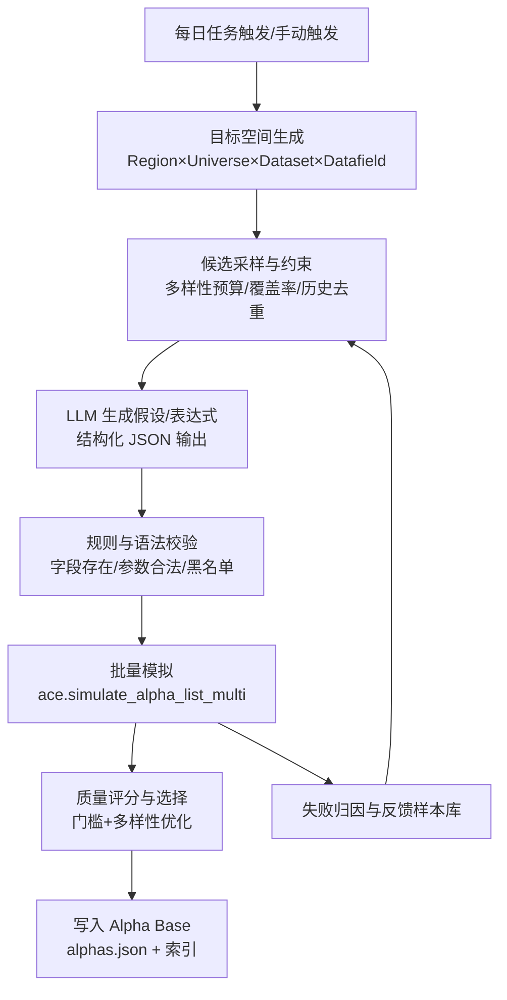

# AIAC 2.0（AIACV2）基于 Alpha-GPT 的持续多样性 Alpha 挖掘系统——需求说明文档

版本：v0.2  
日期：2026-01-23  
状态：草案（可直接用于后续详细设计与实施拆解）

---

## 1. 背景与目标

### 1.1 背景

当前项目（[test.py](file:///e:/AIACV2_v1.2/test.py)）已经具备一条“研究假设 → LLM 生成表达式 → BRAIN 批量模拟 → 打标签与描述 → 导出 alphas.json”的完整链路，能从单个假设与指定数据集（示例为 `model110`）产出一批候选 Alpha，并尝试模拟与落库（[alphas.json](file:///e:/AIACV2_v1.2/alphas.json)）。

用户希望基于 Alpha-GPT 的理念，对本项目进行系统化改造，实现“持续不断挖掘不同区域、不同数据集、不同字段组合的多样性 Alpha”，并形成稳定、可扩展、可控的自动化流程：每天稳定挖掘 3–4 个合格 Alpha（以模拟成功 + 满足质量门槛为准）。

### 1.2 总目标（North Star）

- 每日自动产出并筛选出 3–4 个“多样性” Alpha（跨区域/数据集/字段/算子/周期维度尽量分散），并完成模拟、打标签、写入 Alpha Base（本地文件或可替换存储）。
- 在不依赖用户编写复杂提示词的前提下，用“可配置的 Prompt 资产 + 稳定输出结构 + 规则校验 + 反馈闭环”约束大模型，提高生成代码/表达式的稳定性与可控性。
- 保留人工可介入（Human-in-the-Loop）能力：允许人工调整目标区域/数据集偏好、质量门槛、多样性策略，或对每日产出进行抽检与反馈。

### 1.3 不在本阶段范围（Out of Scope）

- 训练/微调自有模型（默认使用 OpenAI 兼容 API 的现有模型）。
- 构建 WebUI（本阶段默认 CLI/脚本化运行；可在后续迭代中扩展）。
- 复杂的组合 Alpha（SUPER/组合回测编排）与组合优化（可作为后续扩展点）。

---

## 2. 术语与定义

- Alpha：WorldQuant BRAIN 的表达式因子（REGULAR 为主），通过模拟获得统计指标（如 Sharpe、Fitness、Turnover、returns、drawdown、margin 等）。
- Region：市场区域（如 USA、KOR、EUR、ASI、GLB、IND 等，实际以 BRAIN API 返回为准）。
- Universe：股票池（如 TOP3000、TOP2500、TOP600、TOP500、MINVOL1M 等，实际以 BRAIN 规则为准）。
- Dataset：数据集（如 `model110`），包含若干可用数据字段（Datafields）。
- Datafield：数据字段（如 `mdl110_growth`），包含覆盖率、日期覆盖、brain平台已提交 Alpha 数（alphaCount）等元信息。
- Operators：BRAIN 可用算子集合（从 API 拉取，当前项目已有 [get_operators_reference](file:///e:/AIACV2_v1.2/test.py#L11-L44)）。
- 多样性（Diversity）：在同一时间窗口内，Alpha 在至少一个维度显著不同：Region、Universe、Dataset、Datafield、算子类别、时间尺度、经济学逻辑等。
- Alpha Base：本地/远端的 Alpha 元数据与结果仓库（本项目当前以 [alphas.json](file:///e:/AIACV2_v1.2/alphas.json) 为雏形）。

---

## 2.1 BRAIN 平台“事实基线”（通过 MCP 拉取）

本节把“哪些参数是合法的、哪些数据集字段真实存在”明确落地，避免需求停留在抽象层。后续实现与提示词都必须以此为准（运行时仍以 API 返回为最终真值）。

### 2.1.1 可用模拟设置（EQUITY）

已验证的 Region/Universe/Delay/Neutralization 组合（节选，来源：平台设置选项）：

- Region（EQUITY）：USA、GLB、EUR、ASI、CHN、KOR、HKG、IND
- Delay：USA/EUR 支持 0/1；GLB/ASI/CHN/KOR/HKG/IND 支持 1（CHN 也支持 0）
- Neutralization（常见）：NONE、MARKET、SECTOR、INDUSTRY、SUBINDUSTRY，以及 REVERSION_AND_MOMENTUM、CROWDING、FAST、SLOW、SLOW_AND_FAST、STATISTICAL（不同 region 支持项略有差异）

Universe（按 Region）：

- USA：TOP3000 / TOP1000 / TOP500 / TOP200 / ILLIQUID_MINVOL1M / TOPSP500
- GLB：TOP3000 / MINVOL1M / TOPDIV3000
- EUR：TOP2500 / TOP1200 / TOP800 / TOP400 / ILLIQUID_MINVOL1M
- ASI：MINVOL1M / ILLIQUID_MINVOL1M
- CHN：TOP2000U
- KOR：TOP600
- HKG：TOP800 / TOP500
- IND：TOP500

### 2.1.2 Dataset 元信息（用于“数据探索策略”）

通过数据集列表接口可以获得每个 dataset 的关键元信息，用于“选什么数据集/字段更可能有增量”：

- dataset_id / name / description
- region / category / dataset_id / subcategory-对data_filed进行分类（可用来做分层覆盖，保证多样性）
- coverage / dateCoverage（可用来过滤低覆盖数据）
- alphaCount（历史被用在多少 alpha 里，可用来“避开过饱和数据集/字段”）
- fieldCount（字段数；也决定单数据集可挖掘空间）
- pyramidMultiplier（平台鼓励程度，可用于优先级）
- researchPapers（通常包含“Getting started with XXX datasets”的入门与研究贴）

示例：`model110`（USA / TOP3000 / delay=1）

- dataset_id：model110
- fieldCount：8（可挖掘空间小，但字段质量高、解释性强）
- coverage：0.8583
- alphaCount：5552
- pyramidMultiplier：1.4
- 入门资料：Getting started with Model Datasets（平台提供链接）

### 2.1.3 Datafields 元信息（用于“字段采样与多样性”）

示例：`model110` 的可用字段（USA / TOP3000 / delay=1，全量 8 个）：

| datafield_id | type | 说明 | coverage | alphaCount |
|---|---|---|---:|---:|
| mdl110_score | MATRIX | 总分（多风格聚合） | 0.8583 | 2648 |
| mdl110_quality | MATRIX | 质量风格聚合 | 0.8583 | 1455 |
| mdl110_analyst_sentiment | MATRIX | 分析师/情绪聚合 | 0.8583 | 757 |
| mdl110_price_momentum_reversal | MATRIX | 动量/反转影响 | 0.8583 | 706 |
| mdl110_alternative | MATRIX | 另类因子聚合 | 0.8583 | 687 |
| mdl110_growth | MATRIX | 成长风格聚合 | 0.8583 | 608 |
| mdl110_tree | MATRIX | 非线性树模型聚合 | 0.8583 | 544 |
| mdl110_value | MATRIX | 价值风格聚合 | 0.8583 | 485 |

对需求的直接影响：

- “不同数据集字段的多样性”必须基于 fieldCount/alphaCount/coverage 来做预算分配：fieldCount 小的数据集更适合“跨数据集扩散”，fieldCount 大的数据集更适合“同数据集内分层采样 + 去重”。
- 字段 type（如 MATRIX / VECTOR / GROUP 等）会影响表达式模板与算子可用性：需求必须把“字段类型驱动的模板选择/校验”写进规则层（当前项目提示词里已有 VECTOR 相关提醒，但需做程序兜底）。

### 2.1.4 Operators 元信息（用于“提示词与程序校验”）

算子接口可返回：

- name / category（Arithmetic、Logical、Time Series、Cross Sectional、Group、Vector、Transformational、Special 等）
- definition（包含参数命名与默认值，是“语法校验”的第一手依据）
- scope（REGULAR / COMBO / SELECTION）

对需求的直接影响：

- 不能仅靠提示词约束，必须在“规则校验层”基于 definition 做参数合法性检查（例如 `ts_rank(x, d, constant = 0)`、`ts_quantile(x, d, driver="gaussian")` 等必须走命名参数，避免生成 `ts_rank(x,d,0)` 这类常见错误）。

---

## 3. 现状梳理（As-Is）

### 3.1 当前已有能力

- OpenAI 兼容 API 调用与 JSON 输出约束：见 [call_llm](file:///e:/AIACV2_v1.2/test.py#L111-L153)。
- 数据引用注入：算子参考与数据集字段参考：见 [get_dataset_reference](file:///e:/AIACV2_v1.2/test.py#L48-L67)。
- 表达式生成：见 [generate_alpha_expressions](file:///e:/AIACV2_v1.2/test.py#L155-L239)（包含部分“关键语法规则”约束）。
- 批量模拟：见 [simulate_alphas_batch](file:///e:/AIACV2_v1.2/test.py#L291-L399)（基于 `ace.simulate_alpha_list_multi`）。
- 回写标签与描述：见 [add_llm_tags_and_descriptions](file:///e:/AIACV2_v1.2/test.py#L401-L454)。
- 输出落盘：`alphas.json`（包含模拟成功/失败与部分统计结果）。

### 3.2 当前主要不足（To-Be 驱动点）

- 多样性不可控：固定 Region/Universe/Dataset，无法系统覆盖“不同区域/不同数据集字段”。
- 缺少“数据集/字段探索策略”：目前需要人工指定 `dataset_id`；缺少自动枚举、筛选、分层采样的机制。
- 缺少“质量门槛 + 多样性门槛”的选拔：当前只记录 success/failed，缺少统一评分与最终入库决策。
- 缺少“去重与反抄袭”：同字段同结构表达式容易重复；需要表达式/字段/算子/逻辑多维去重。
- 缺少“反馈闭环”：失败原因未结构化用于下一轮生成（例如字段不存在、算子参数错误、模拟无 alpha_id 等）。
- 缺少“每日任务调度与可观察性”：没有 run_id、统计报表、失败分布、每日产出汇总与回溯能力。
- 缺少“限流与重试策略”：平台接口可能出现 429（Too Many Requests），需要在数据拉取与模拟阶段做退避与重试，并把失败归因结构化，数据拉取是单并发并可以设置拉取间隔，模拟是多并发并可以设置并发数。

---

## 4. 需求概述（To-Be）

### 4.1 核心用户故事

1. 作为研究者，我希望系统每天自动在多个区域/数据集/字段上探索，产出 3–4 个新的、互不相似的可用 Alpha，尽可能覆盖不同信息源与周期。
2. 作为使用者，我不想手写复杂提示词；我希望用少量配置（目标区域、偏好数据集/类别、质量门槛、多样性策略）即可约束大模型稳定输出。
3. 作为维护者，我希望所有产出可追溯（用到哪些字段/算子/Prompt/模型），失败可归因并用于下一轮修正。

### 4.2 成功标准（高层验收）

- 连续 5 个自然日运行中，至少 4 天能产出 ≥3 个入库 Alpha（以模拟成功 + 达标为准）。
- 入库 Alpha 的“多样性指标”达标（详见 6.6）：同日入库 Alpha 不应集中在单一 Dataset 或单一字段组合。
- 运行过程可追溯：每个 Alpha 关联 run_id、region/universe/dataset、字段/算子列表、生成与筛选理由、模拟关键指标与失败原因（若失败）。

---

## 5. 总体方案（文本架构）

### 5.1 总体流程



### 5.2 关键设计思想（用于“稳定性约束”）

- “先选数据后写表达式”：先确定 Region/Universe/Dataset/Datafield 组合，LLM 只在给定集合内创作，减少发散与幻觉字段。
- “结构化输出 + 程序校验”：LLM 输出严格 JSON；程序对表达式做语法规则与参数规则校验，失败样本进入反馈闭环。
- “多样性预算管理”：把“每天挖 3–4 个”做成预算问题，先在目标空间分层抽样，再用评分+多样性挑选最终入库集合。

---

## 6. 功能需求（Functional Requirements）

### 6.1 配置与运行入口

- 支持以配置驱动运行（默认本地配置即可）：
  - 目标区域列表（Region[]）
  - 每个区域的 Universe 列表或默认值
  - delay（0/1，且必须与 region 匹配）
  - neutralization（必须是该 region/universe 允许的值）
  - 每日目标入库数量（默认 3–4）
  - 候选生成批量（例如先生成 20–40 个候选，再筛选入库）
  - 质量门槛（Sharpe/Fitness/Turnover/Drawdown、returns、margin 等的阈值）
  - 多样性权重与约束（详见 6.6）
  - 字段/算子黑名单（例如禁用某些高泄露字段或不稳定算子）
- 支持两种模式：
  - Daily 自动模式：自动探索与入库。
  - Research 手动模式：指定 Region/Dataset/主题，输出候选与报告但不必入库。

### 6.2 目标空间生成（区域×数据集×字段）

- 能自动获取可用 Dataset 列表与其元信息（来自 BRAIN API；当前项目已有 `ace.get_datasets` 与 `ace.get_datafields` 的使用方式，见 [get_dataset_reference](file:///e:/AIACV2_v1.2/test.py#L48-L67)）。
- 能按策略筛选 Dataset：
  - 覆盖率（coverage）、日期覆盖（dateCoverage）、字段数量（fieldCount）、历史 alphaCount、pyramidMultiplier 等维度。
  - 支持“分层”：类别/子类别（category/subcategory）维度覆盖。
- 能按策略筛选 Datafield：
  - coverage ≥ 最小阈值（可配置）
  - alphaCount ≤ 最大阈值（鼓励冷门字段）
  - type 过滤（例如只选数值型字段）
  - 支持“字段组合”：单字段 / 双字段 / 多字段组合（组合规模可配置）

### 6.2.1 面向“每日 3–4 个入库”的采样预算（必须明确）

需求必须显式定义“探索预算”与“选择预算”，否则很难稳定产出：

- 每日探索预算：候选表达式总数上限（例如 30–80，可配置）
- 每日模拟预算：模拟请求总数上限（例如 20–60，可配置）
- 每日入库预算：最终入库 3–4

建议的分层预算（可配置，默认策略）：

- 先按 Region 分配预算（若只跑单 Region，则按 Dataset 分配）
- 再按 category/subcategory 做覆盖（尽量不把预算全给同一类数据）
- 再按 dataset_id 做去饱和抽样：优先选择 alphaCount 低且 coverage 足够的数据集/字段

### 6.3 假设生成（可选）与主题编排

- 系统可在以下两种方式间切换：
  1) 用户提供高层研究主题（例如“增长 + 低波动”），系统在不同 Dataset/Datafield 上做“主题映射”生成表达式。
  2) 系统根据 Dataset/Datafield 自动生成微假设（micro-hypothesis），用于引导表达式构造（更利于多样性）。
- 假设必须可追溯：记录假设文本、生成策略版本、与所用字段的关联。

### 6.4 Alpha 表达式生成（LLM 受控产出）

- 对 LLM 的输入必须包含：
  - 可用 Operators 列表（来自 API）
  - 可用 Datafields 列表（来自 API，且与当前采样的 Dataset/Region/Universe 匹配）
  - 明确的语法约束与输出 JSON schema（当前项目已有实践，见 [call_llm](file:///e:/AIACV2_v1.2/test.py#L111-L153) 与 [generate_alpha_expressions](file:///e:/AIACV2_v1.2/test.py#L155-L215)）
- 输出必须为严格 JSON，至少包含：
  - alpha_expression（单行表达式）
  - economic_rationale（与表达式一一对应，且与字段/逻辑一致）
  - data_fields_used（必须是表达式中出现的字段子集）
  - operators_used（必须是表达式中出现的算子子集）
- 支持“多候选生成”：每个采样目标组合生成 N 个候选，以便后续筛选。

### 6.5 规则校验与去重

在进入模拟前必须执行程序校验（LLM 输出不可信，必须做守门）：

- 字段存在性：`data_fields_used` 必须都在当前 datafields 列表内；表达式中出现的字段也必须可解析并存在。
- 算子合法性：表达式中的算子必须在 operators 列表内。
- 参数规则（示例，需可配置扩展）：
  - lookback 参数为正整数
  - 某些算子参数必须显式命名（当前项目已写入 Prompt 约束，仍需程序兜底）
  - scope 校验：仅使用 scope=REGULAR 的算子（避免 SELECTION/COMBO 的算子混入导致模拟失败）
- 去重策略：
  - 精确去重：alpha表达式和settings hash值完全一样视为重复。
  - 近似去重：同字段集合 + 同算子集合高度重合时降权或丢弃（阈值可配置）。
  - 历史去重：与 Alpha Base 历史记录比对，避免重复挖掘同套路。

### 6.6 模拟、评分与多样性选择

- 模拟：
  - 使用批量模拟接口进行并发模拟（当前项目已实现，见 [simulate_alphas_batch](file:///e:/AIACV2_v1.2/test.py#L291-L399)）。
  - 需要具备“失败归因”字段（例如：无 alpha_id、字段错误、表达式语法错误、API 限流等）。
- 评分（Quality Gate）：
  - 至少支持用模拟结果中的核心指标做阈值筛选（阈值可配置）。
  - 示例指标：Sharpe、Fitness、Turnover、Drawdown、Returns、Margin 等（具体字段以 BRAIN 返回为准）。
- 多样性选择（Diversity Gate）：
  - 在通过质量门槛的候选中，使用多样性目标选出每日 3–4 个最终入库 Alpha。
  - 需要最少覆盖以下多样性维度（可配置权重）：
    - Region/Universe 多样性：不同月份尽量覆盖多个 region，每个月挖同一个region。
    - Dataset 多样性：同日尽量不都来自同一 dataset_id。
    - Datafield 多样性：同日 data_fields_used 的 Jaccard 相似度不应过高。
    - Operator 多样性：尽量覆盖不同算子类别（Time Series/Cross Sectional/Group 等）。
    - 时间尺度多样性：不同 lookback 组合分散（短、中、长周期）。

### 6.7 Alpha Base（结果仓库）与可追溯性

- Alpha Base 至少支持本地文件存储（在现有 [alphas.json](file:///e:/AIACV2_v1.2/alphas.json) 基础上扩展字段，不改变其“列表对象”主结构）。
- 每条记录应包含（最低要求）：
  - run_id（每日/每次运行唯一）
  - created_at（时间戳）
  - region / universe / dataset_id
  - hypothesis / micro_hypothesis（若使用）
  - alpha_expression / economic_rationale
  - data_fields_used / operators_used
  - llm_model / llm_tag / prompt_version（或 prompt_hash）
  - simulation_status / simulation_error（失败原因）
  - simulation 结果结构（原样或关键字段抽取）
  - selection_decision（入库/淘汰）与原因（质量门槛/多样性门槛）
- 需要提供索引/汇总能力（可先以简单的“每日汇总输出”实现）：
  - 今日候选数量、模拟成功数量、入库数量
  - 失败原因 TopN
  - 入库 Alpha 的多样性统计（按 dataset、字段、算子类别分布）

### 6.8 反馈闭环（失败样本与提示词资产化）

- 将失败样本结构化记录，用于下一轮避免同类错误：
  - 字段不存在 → 加入字段黑名单或修正 datafield 解析
  - 算子参数错误 → 加强程序校验与 Prompt 规则提示
  - 模拟无 alpha_id → 调整并发/批次大小、重试策略、或降温度
- Prompt 资产化目标：
  - 把“提示词”拆成可版本化的片段：系统提示、规则提示、输出 schema、few-shot 示例（可选）
  - 通过版本号/哈希写入 Alpha Base，保证可复现

---

## 7. 非功能需求（Non-Functional Requirements）

- 稳定性：LLM 输出必须结构化；遇到解析失败可自动重试（重试次数可配置）。
- 可控性：温度、最大 token、生成批量、并发数、筛选阈值均可配置。
- 可扩展性：新增 Region/Dataset 策略不应大改主流程；新增评分指标与多样性维度应可插拔。
- 安全性：
  - 不在仓库内硬编码 API Key；默认使用环境变量（当前项目已采用，见 [README.md](file:///e:/AIACV2_v1.2/README.md#L23-L39)）。
  - 日志中不输出敏感信息。
- 成本控制：对 LLM 调用与 BRAIN 模拟设置预算（每日最大候选数/最大模拟数/最大重试数）。

---

## 7.1 工程规范与代码风格（必须）

本项目的目标是“每天稳定产出 + 可持续迭代”。因此代码规范不是锦上添花，而是验收条件的一部分。

### 7.1.1 总体原则（高内聚、低耦合、可替换）

- 核心业务逻辑必须与平台实现解耦：核心层不得直接依赖 BRAIN/QLib 等平台 SDK；只能依赖抽象接口（Ports）。
- 平台相关逻辑收敛到 Adapter：BRAIN 只是一种 Adapter，实现统一的 `DataProvider` / `Simulator` / `Publisher` 等接口。
- 依赖注入：核心流程由“接口 + 实现”在组装层（Composition Root）注入，禁止在核心模块中创建网络客户端或读取环境变量。
- 可测试优先：核心模块设计为可纯函数化/可 mock 的组件；任何模块都必须能单独运行单测，不依赖外网。

### 7.1.2 Python 风格与类型要求

- 全量类型标注（type hints），对外接口与核心数据结构必须显式类型。
- 核心配置使用结构化对象（推荐 dataclass/pydantic），禁止在业务代码里散落 dict magic key。
- 不在核心路径使用隐式全局状态（例如全局 session、全局随机种子、全局配置）；所有外部依赖必须显式传入。
- 错误处理使用“领域错误类型”分层（例如：数据获取错误、表达式校验错误、平台限流错误、模拟失败等），并在最外层统一汇总。

### 7.1.3 参考实现风格（rdagent）

可参考 rdagent 类项目的工程化经验（不是复制代码，而是对齐思想）：

- 把系统拆成多角色/多阶段组件（Agent/Tool/Planner/Executor），每个组件只负责单一职责。
- 工具调用与外部 I/O 都通过“工具接口”封装，便于替换实现与做 mock。
- 全链路可观测：每个阶段产出结构化记录（输入/输出/耗时/失败原因），便于复盘与迭代提示词资产。

## 7.2 模块化架构与边界（必须）

### 7.2.1 推荐分层（Ports & Adapters / Hexagonal）

- Core（核心领域层）：多样性挖掘策略、预算分配、表达式生成编排、校验/去重/选择器、Alpha Base 领域模型。
- Ports（抽象接口层）：定义 `LLMClient`、`DatasetCatalog`、`DatafieldCatalog`、`OperatorCatalog`、`Simulator`、`AlphaPublisher`、`Storage` 等接口。
- Adapters（实现层）：`brain_adapter`、未来的 `qlib_adapter` 等，负责把平台 API 映射到 Ports。
- App（应用层/编排层）：Daily runner、research runner、pipeline 组装、依赖注入、日志与指标。

### 7.2.2 BRAIN 相关拆分要求（为了未来接入 QLib）

下列能力必须抽象为平台无关接口，BRAIN 只是其中一个实现：

- 平台设置与合法性：Region/Universe/Delay/Neutralization 的可用组合查询与校验。
- 数据发现：datasets/datafields/operators 的枚举、搜索、筛选。
- 模拟执行：单 alpha 与批量 alpha 的模拟与状态查询。
- 发布与元信息写入：打标签、写描述、提交（若后续需要）。

核心层只关心“策略与规则”：如何采样、如何约束 LLM、如何评分与做多样性选择；不关心“BRAIN 的 URL/鉴权/请求细节”。

## 7.3 可测试性与测试策略（必须）

### 7.3.1 单元测试范围

每个模块必须具备可离线单测（不调用外网）的测试用例：

- 策略层：预算分配、多样性选择、去重策略、评分门槛逻辑。
- 校验层：表达式解析、字段/算子存在性校验、参数规则校验、scope 校验。
- Prompt 资产层：prompt 组装是否满足 schema/规则、可复现性（prompt_hash）是否稳定。
- 存储层：Alpha Base 读写、增量追加、索引/汇总输出。

### 7.3.2 契约测试（Adapters）

- 对 BRAIN/QLib 等 Adapter 实现必须做契约测试：同一组输入在接口层的行为一致（例如：`list_datasets` 返回结构、`get_datafields` 的字段语义、`simulate` 的失败归因格式）。
- Adapter 层测试允许使用 mock server/录制回放（如 VCR 之类思路），但核心层测试不得依赖网络。

### 7.3.3 端到端测试（最小化）

- 提供一个最小 E2E pipeline，用 Mock Adapter + Mock LLM 生成固定输出，验证整条流程能产出“3–4 个入库结果”的结构化记录。

---

## 8. 为了让大模型更好理解并“稳定生成”，需要准备哪些数据

### 8.1 必须提供/系统必须拉取的数据（硬约束）

- Operators Reference：BRAIN 可用算子列表（当前已实现）。
- Dataset + Datafields Reference：目标 dataset 的字段、覆盖率、类型、alphaCount 等（当前已实现）。
- 目标运行配置：Region/Universe 列表、每日目标数量、质量门槛、多样性策略。
- 合法设置字典：每个 Region 对应的 Universe、Delay、Neutralization（必须来自平台设置选项）。

### 8.2 强烈建议提供的数据（显著提升稳定性与质量）

- 历史 Alpha Base（已有 [alphas.json](file:///e:/AIACV2_v1.2/alphas.json)）：用于去重、风格学习、失败规避。
- 质量偏好：你更重视哪些指标（例如更偏好低回撤还是高 Sharpe）。
- 禁用清单：
  - 禁用字段（例如你认为泄露/不稳定/覆盖率低的字段）
  - 禁用算子（例如你不希望使用的算子类别）
- 期望的多样性配额：例如“每周覆盖至少 6 个 dataset、1 个 region”。

---

## 8.3 可复用的社区/论坛资料（用于模板与踩坑规避）

以下条目来自论坛检索结果，可作为实现阶段的参考输入（例如：补齐表达式语法校验、模板化生成、批量回测的断点续传等）：

- [一个简单的 regular alpha expression 语法检测程序](https://support.worldquantbrain.com/hc/zh-cn/search/click?data=BAh7DjoHaWRsKwiXz%2BGN2SA6D2FjY291bnRfaWRpA9GrqjoJdHlwZUkiE2NvbW11bml0eV9wb3N0BjoGRVQ6CHVybEkiAcdodHRwczovL3N1cHBvcnQud29ybGRxdWFudGJyYWluLmNvbS9oYy96aC1jbi9jb21tdW5pdHkvcG9zdHMvMzYxMTg3NjAzNzgyNjMtJUU0JUI4JTgwJUU0JUI4JUFBJUU3JUFFJTgwJUU1JThEJTk1JUU3JTlBJTg0cmVndWxhci1hbHBoYS1leHByZXNzaW9uJUU4JUFGJUFEJUU2JUIzJTk1JUU2JUEzJTgwJUU2JUI1JThCJUU3JUE4JThCJUU1JUJBJThGBjsIVDoOc2VhcmNoX2lkSSIpODc5ZDJlM2QtZDRkNS00ZjA3LWFjZGQtNjY1OWI2YzM4ZjNkBjsIRjoJcmFua2kGOgtsb2NhbGVJIgp6aC1jbgY7CFQ6CnF1ZXJ5SSIyYWxwaGEgdGVtcGxhdGUgUkVHVUxBUiBleHByZXNzaW9uIGpzb24gc2NoZW1hBjsIVDoScmVzdWx0c19jb3VudGkB8w%3D%3D--f5b577caf61fad557117ae1c2279146e03984c8e)
- [AI 比赛 generate_alpha_description 函数范例](https://support.worldquantbrain.com/hc/zh-cn/search/click?data=BAh7DjoHaWRsKwiXRdS3HiE6D2FjY291bnRfaWRpA9GrqjoJdHlwZUkiE2NvbW11bml0eV9wb3N0BjoGRVQ6CHVybEkiAbtodHRwczovL3N1cHBvcnQud29ybGRxdWFudGJyYWluLmNvbS9oYy96aC1jbi9jb21tdW5pdHkvcG9zdHMvMzY0MTU4MTY4Nzc0NjMtLSVFOSU5OSU4NCVFNSVCOCVBNkFJLUFscGhhcy1BSSVFNiVBRiU5NCVFOCVCNSU5QmdlbmVyYXRlLWFscGhhLWRlc2NyaXB0aW9uJUU1JTg3JUJEJUU2JTk1JUIwJUU4JThDJTgzJUU0JUJFJThCBjsIVDoOc2VhcmNoX2lkSSIpODc5ZDJlM2QtZDRkNS00ZjA3LWFjZGQtNjY1OWI2YzM4ZjNkBjsIRjoJcmFua2kHOgtsb2NhbGVJIgp6aC1jbgY7CFQ6CnF1ZXJ5SSIyYWxwaGEgdGVtcGxhdGUgUkVHVUxBUiBleHByZXNzaW9uIGpzb24gc2NoZW1hBjsIVDoScmVzdWx0c19jb3VudGkB8w%3D%3D--72a80163f87023fcbad9787526419cebc976de48)
- [用 AI 自动写 regular_description 和 super_description（即插即用版）](https://support.worldquantbrain.com/hc/zh-cn/search/click?data=BAh7DjoHaWRsKwiXpvwYQh86D2FjY291bnRfaWRpA9GrqjoJdHlwZUkiE2NvbW11bml0eV9wb3N0BjoGRVQ6CHVybEkiAc5odHRwczovL3N1cHBvcnQud29ybGRxdWFudGJyYWluLmNvbS9oYy96aC1jbi9jb21tdW5pdHkvcG9zdHMvMzQzNjg3NDc1MTM0OTUtLSVFNSU4RCVCMyVFNiU4RiU5MiVFNSU4RCVCMyVFNyU5NCVBOCVFNyU4OSU4OC0lRTclOTQlQThBSSVFOCU4NyVBQSVFNSU4QSVBOCVFNSU4NiU5OXJlZ3VsYXItZGVzY3JpcHRpb24lRTUlOTIlOENzdXBlci1kZXNjcmlwdGlvbgY7CFQ6DnNlYXJjaF9pZEkiKTg3OWQyZTNkLWQ0ZDUtNGYwNy1hY2RkLTY2NTliNmMzOGYzZAY7CEY6CXJhbmtpCDoLbG9jYWxlSSIKemgtY24GOwhUOgpxdWVyeUkiMmFscGhhIHRlbXBsYXRlIFJFR1VMQVIgZXhwcmVzc2lvbiBqc29uIHNjaGVtYQY7CFQ6EnJlc3VsdHNfY291bnRpAfM%3D--7a9364806d21058669b3fb71b72cfe6205bf41ed)
- [构建自已的 Template，同时并行回测 Alpha Machine 的一二三阶程序](https://support.worldquantbrain.com/hc/zh-cn/search/click?data=BAh7DjoHaWRsKwgXGh%2Fb1hs6D2FjY291bnRfaWRpA9GrqjoJdHlwZUkiE2NvbW11bml0eV9wb3N0BjoGRVQ6CHVybEkiAgQBaHR0cHM6Ly9zdXBwb3J0LndvcmxkcXVhbnRicmFpbi5jb20vaGMvemgtY24vY29tbXVuaXR5L3Bvc3RzLzMwNjA5NjEzMTk5ODk1LSVFNiU5RSU4NCVFNSVCQiVCQSVFOCU4NyVBQSVFNSVCNyVCMiVFNyU5QSU4NFRlbXBsYXRlJUU1JTkwJThDJUU2JTk3JUI2LSVFNSVCOSVCNiVFOCVBMSU4QyVFNSU5QiU5RSVFNiVCNSU4QkFscGhhLU1hY2hpbmUlRTclOUElODQlRTQlQjglODAlRTQlQkElOEMlRTQlQjglODklRTklOTglQjYlRTclQTglOEIlRTUlQkElOEYGOwhUOg5zZWFyY2hfaWRJIik4NzlkMmUzZC1kNGQ1LTRmMDctYWNkZC02NjU5YjZjMzhmM2QGOwhGOglyYW5raQs6C2xvY2FsZUkiCnpoLWNuBjsIVDoKcXVlcnlJIjJhbHBoYSB0ZW1wbGF0ZSBSRUdVTEFSIGV4cHJlc3Npb24ganNvbiBzY2hlbWEGOwhUOhJyZXN1bHRzX2NvdW50aQHz--a914f6e3e0a530239853328010c1f3e8912ec8fb)
- [使用程序提交 alpha 之前，必需做的一件事（PPAC）](https://support.worldquantbrain.com/hc/zh-cn/search/click?data=BAh7DjoHaWRsKwgXf%2FHXLhw6D2FjY291bnRfaWRpA9GrqjoJdHlwZUkiE2NvbW11bml0eV9wb3N0BjoGRVQ6CHVybEkiAd9odHRwczovL3N1cHBvcnQud29ybGRxdWFudGJyYWluLmNvbS9oYy96aC1jbi9jb21tdW5pdHkvcG9zdHMvMzA5ODc1MTcwMDE0OTUtLVBQQUMtJUU0JUJEJUJGJUU3JTk0JUE4JUU3JUE4JThCJUU1JUJBJThGJUU2JThGJTkwJUU0JUJBJUE0YWxwaGElRTQlQjklOEIlRTUlODklOEQtJUU1JUJGJTg1JUU5JTlDJTgwJUU1JTgxJTlBJUU3JTlBJTg0JUU0JUI4JTgwJUU0JUJCJUI2JUU0JUJBJThCBjsIVDoOc2VhcmNoX2lkSSIpODc5ZDJlM2QtZDRkNS00ZjA3LWFjZGQtNjY1OWI2YzM4ZjNkBjsIRjoJcmFua2kMOgtsb2NhbGVJIgp6aC1jbgY7CFQ6CnF1ZXJ5SSIyYWxwaGEgdGVtcGxhdGUgUkVHVUxBUiBleHByZXNzaW9uIGpzb24gc2NoZW1hBjsIVDoScmVzdWx0c19jb3VudGkB8w%3D%3D--a6f97dc2be300d0027c26545ce85cd2fb688969d)


---

## 9. 验收标准（Acceptance Criteria）

- 结构正确：
  - 运行结束后产出 Alpha Base 文件（可在 `alphas.json` 上追加）并包含 run_id 与关键元信息。
  - 任意一条入库记录可追溯到 region/universe/dataset/fields/operators 与模型信息。
- 工程质量：
  - 核心层代码不直接引用 BRAIN SDK/HTTP 细节，平台能力均经由抽象接口注入。
  - 新增一个“非 BRAIN 平台”（例如 QLib）的 Adapter 不需要修改核心策略与选择逻辑。
  - 每个核心模块有独立单元测试；核心测试集可在离线环境完成执行。
- 产出达标：
  - 单次运行可生成候选并完成模拟；最终入库数量在 3–4（可配置）。
  - 入库 Alpha 通过质量门槛，并通过多样性门槛（至少 dataset/字段集合不高度重叠）。
- 失败可归因：
  - 失败记录包含可读的失败原因，并在每日汇总中统计 TopN。

---

## 10. 里程碑建议（供实施拆解）

1. v0（快速可用）：把当前单脚本流程模块化，加入 run_id、入库决策、基础去重与汇总输出。
2. v1（多样性驱动）：实现 dataset/field 自动探索与分层采样；实现多样性选择器。
3. v2（Alpha-GPT 化）：引入多代理/多阶段：数据探索代理、表达式生成代理、审查与修复代理、分析与反馈代理。

---

## 11. 数据存储与知识库（PostgreSQL / Milvus / MinIO）

### 11.1 目标

- PostgreSQL：保存论坛所有原始数据与结构化数据（文章、评论、图片、Alpha 表达式、采集记录）。
- Milvus：用于 RAG 的向量索引（对文章/评论/图片 OCR 文本等做切分与向量化）。
- MinIO：用于图片等二进制附件存储（对象存储），PostgreSQL 存元数据与引用。
- Redis：用于缓存（例如brain平台数据集、字段、算子等平台数据，防止重复请求）。

### 11.2 PostgreSQL：数据范围与表结构（建议）

#### 数据范围

- WorldQuant BRAIN 中文论坛原始数据：文章、评论、作者信息、发布时间、标签、原始 HTML/Markdown、引用链接等。
- 结构化抽取数据：Alpha 表达式（原文出现/评论中出现/代码块出现）、相关解释、作者/帖子来源、抽取置信度。
- 采集与处理过程数据：采集任务、增量游标、失败原因、重试次数、处理耗时等。

#### 表结构（核心表）

```sql
CREATE TABLE public.datasets (
	id serial4 NOT NULL,
	dataset_id varchar(100) NOT NULL,
	region varchar(10) NOT NULL,
	universe varchar(50) NOT NULL,
	"name" varchar(200) NOT NULL,
	category varchar(100) NULL,
	subcategory varchar(100) NULL,
	description text NULL,
	coverage numeric(5, 4) NULL,
	value_score int4 NULL,
	user_count int4 NULL,
	alpha_count int4 NULL,
	field_count int4 NULL,
	pyramid_multiplier numeric(3, 2) NULL,
	delay int4 DEFAULT 1 NULL,
	is_active bool DEFAULT true NULL,
	last_synced_at timestamp NULL,
	created_at timestamp DEFAULT CURRENT_TIMESTAMP NULL,
	updated_at timestamp DEFAULT CURRENT_TIMESTAMP NULL,
	CONSTRAINT datasets_dataset_id_region_delay_universe_key UNIQUE (dataset_id, region, delay, universe),
	CONSTRAINT datasets_pkey PRIMARY KEY (id)
);

CREATE TABLE public.datafields (
	id serial4 NOT NULL,
	dataset_id int4 NULL,
	region varchar(10) NOT NULL,
	universe varchar(50) NOT NULL,
	delay int4 DEFAULT 1 NULL,
	field_id varchar(200) NOT NULL,
	field_name varchar(200) NOT NULL,
	field_type varchar(50) NULL,
	description text NULL,
	is_active bool DEFAULT true NULL,
	created_at timestamp DEFAULT CURRENT_TIMESTAMP NULL,
	CONSTRAINT datafields_dataset_id_field_id_key UNIQUE (dataset_id, field_id),
	CONSTRAINT datafields_pkey PRIMARY KEY (id),
	CONSTRAINT datafields_dataset_id_fkey FOREIGN KEY (dataset_id) REFERENCES public.datasets(id)
);
CREATE INDEX idx_datafields_region_delay_universe ON public.datafields USING btree (region, delay, universe);


CREATE TABLE public.operators (
	id serial4 NOT NULL,
	"name" varchar(100) NOT NULL,
	category varchar(100) NULL,
	description text NULL,
	definition text NULL,
	"scope" _text NULL,
	"level" varchar(50) NULL,
	syntax text NULL,
	param_count int4 DEFAULT 0 NULL,
	is_active bool DEFAULT true NULL,
	created_at timestamp DEFAULT CURRENT_TIMESTAMP NULL,
	CONSTRAINT operators_name_key UNIQUE (name),
	CONSTRAINT operators_pkey PRIMARY KEY (id)
);
-- DROP TABLE public.wqb_posts;
CREATE TABLE public.operator_blacklist (
	id serial4 NOT NULL,
	operator_name varchar(100) NOT NULL,
	error_message text NULL,
	first_seen_at timestamp DEFAULT CURRENT_TIMESTAMP NULL,
	hit_count int4 DEFAULT 1 NULL,
	is_active bool DEFAULT true NULL,
	CONSTRAINT operator_blacklist_operator_name_key UNIQUE (operator_name),
	CONSTRAINT operator_blacklist_pkey PRIMARY KEY (id)
);
CREATE INDEX idx_operator_blacklist_active ON public.operator_blacklist USING btree (is_active);
CREATE INDEX idx_operator_blacklist_name ON public.operator_blacklist USING btree (operator_name);

CREATE TABLE public.alphas (
	id serial4 NOT NULL,
	alpha_id varchar(20) NULL,
	alpha_type varchar(20) DEFAULT 'REGULAR'::character varying NOT NULL,
	author varchar(50) NULL,
	"name" varchar(200) NULL,
	favorite bool DEFAULT false NULL,
	hidden bool DEFAULT false NULL,
	color varchar(20) NULL,
	category varchar(100) NULL,
	tags _text NULL,
	grade varchar(20) NULL,
	stage varchar(10) DEFAULT 'IS'::character varying NULL,
	status varchar(20) DEFAULT 'created'::character varying NULL,
	"expression" text NOT NULL,
	expression_hash varchar(64) NOT NULL,
	expression_description text NULL,
	operator_count int4 NULL,
	template_id int4 NULL,
	generation_batch_id varchar(50) NULL,
	seed_alpha_id varchar(20) NULL,
	instrument_type varchar(20) DEFAULT 'EQUITY'::character varying NULL,
	region varchar(10) NOT NULL,
	universe varchar(50) NOT NULL,
	delay int4 DEFAULT 1 NULL,
	decay int4 DEFAULT 0 NULL,
	neutralization varchar(50) DEFAULT 'NONE'::character varying NULL,
	truncation numeric(5, 4) DEFAULT 0.08 NULL,
	pasteurization varchar(10) DEFAULT 'ON'::character varying NULL,
	unit_handling varchar(20) DEFAULT 'VERIFY'::character varying NULL,
	nan_handling varchar(10) DEFAULT 'ON'::character varying NULL,
	max_trade varchar(10) DEFAULT 'OFF'::character varying NULL,
	"language" varchar(20) DEFAULT 'FASTEXPR'::character varying NULL,
	visualization bool DEFAULT false NULL,
	backtest_start_date date NULL,
	backtest_end_date date NULL,
	settings_json jsonb NULL,
	is_pnl int8 NULL,
	is_book_size int8 NULL,
	is_sharpe numeric(6, 4) NULL,
	is_fitness numeric(6, 4) NULL,
	is_turnover numeric(6, 4) NULL,
	is_returns numeric(6, 4) NULL,
	is_margin numeric(10, 8) NULL,
	is_drawdown numeric(6, 4) NULL,
	is_long_count int4 NULL,
	is_short_count int4 NULL,
	is_start_date date NULL,
	is_self_correlation numeric(6, 4) NULL,
	is_prod_correlation numeric(6, 4) NULL,
	is_checks jsonb NULL,
	is_constrained_pnl int8 NULL,
	is_constrained_book_size int8 NULL,
	is_constrained_sharpe numeric(6, 4) NULL,
	is_constrained_fitness numeric(6, 4) NULL,
	is_constrained_turnover numeric(6, 4) NULL,
	is_constrained_returns numeric(6, 4) NULL,
	is_constrained_margin numeric(10, 8) NULL,
	is_constrained_drawdown numeric(6, 4) NULL,
	is_constrained_long_count int4 NULL,
	is_constrained_short_count int4 NULL,
	os_start_date date NULL,
	os_sharpe numeric(6, 4) NULL,
	os_fitness numeric(6, 4) NULL,
	os_turnover numeric(6, 4) NULL,
	os_returns numeric(6, 4) NULL,
	os_pnl int8 NULL,
	os_drawdown numeric(6, 4) NULL,
	os_is_sharpe_ratio numeric(6, 4) NULL,
	os_pre_close_sharpe_ratio numeric(6, 4) NULL,
	os_checks jsonb NULL,
	classifications jsonb NULL,
	competitions jsonb NULL,
	themes jsonb NULL,
	pyramids jsonb NULL,
	pyramid_themes jsonb NULL,
	team jsonb NULL,
	is_submittable bool DEFAULT false NULL,
	composite_score numeric(6, 4) NULL,
	core_metrics_score numeric(6, 4) NULL,
	risk_control_score numeric(6, 4) NULL,
	complexity_score numeric(6, 4) NULL,
	pnl_quality_score numeric(6, 4) NULL,
	self_corr_result jsonb NULL,
	prod_corr_result jsonb NULL,
	is_all_pass bool DEFAULT false NULL,
	self_corr numeric(6, 4) NULL,
	prod_corr numeric(6, 4) NULL,
	corr_checked_at timestamp NULL,
	error_message text NULL,
	date_created timestamp NULL,
	date_submitted timestamp NULL,
	date_modified timestamp NULL,
	simulated_at timestamp NULL,
	checked_at timestamp NULL,
	submitted_at timestamp NULL,
	created_at timestamp DEFAULT CURRENT_TIMESTAMP NULL,
	updated_at timestamp DEFAULT CURRENT_TIMESTAMP NULL,
	CONSTRAINT alphas_pkey PRIMARY KEY (id),
	CONSTRAINT alphas_template_id_fkey FOREIGN KEY (template_id) REFERENCES public.templates(id)
);
CREATE UNIQUE INDEX idx_alphas_alpha_id_unique ON public.alphas USING btree (alpha_id) WHERE (alpha_id IS NOT NULL);
CREATE INDEX idx_alphas_composite_score ON public.alphas USING btree (composite_score DESC);
CREATE INDEX idx_alphas_expression_hash ON public.alphas USING btree (expression_hash);
CREATE INDEX idx_alphas_is_all_pass ON public.alphas USING btree (is_all_pass) WHERE (is_all_pass = true);
CREATE INDEX idx_alphas_region_delay_universe ON public.alphas USING btree (region, delay, universe);
CREATE INDEX idx_alphas_seed_alpha_id ON public.alphas USING btree (seed_alpha_id);
CREATE INDEX idx_alphas_status ON public.alphas USING btree (status);
CREATE INDEX idx_alphas_template_id ON public.alphas USING btree (template_id);


CREATE TABLE public.wqb_posts (
	id varchar(255) NOT NULL,
	title text NOT NULL,
	"content" text NULL,
	author varchar(255) NULL,
	create_time timestamp NULL,
	url varchar(1024) NULL,
	"type" varchar(50) NULL,
	json_data jsonb NULL,
	created_at timestamp DEFAULT CURRENT_TIMESTAMP NULL,
	updated_at timestamp DEFAULT CURRENT_TIMESTAMP NULL,
	topic_id varchar(255) NULL,
	topic_name varchar(512) NULL,
	CONSTRAINT wqb_posts_pkey PRIMARY KEY (id)
);
CREATE INDEX idx_posts_create_time ON public.wqb_posts USING btree (create_time);
CREATE INDEX idx_posts_type ON public.wqb_posts USING btree (type);

-- public.wqb_comments definition

-- Drop table

-- DROP TABLE public.wqb_comments;

CREATE TABLE public.wqb_comments (
	id varchar(255) NOT NULL,
	post_id varchar(255) NULL,
	"content" text NULL,
	author varchar(255) NULL,
	create_time timestamp NULL,
	json_data jsonb NULL,
	created_at timestamp DEFAULT CURRENT_TIMESTAMP NULL,
	CONSTRAINT wqb_comments_pkey PRIMARY KEY (id),
	CONSTRAINT wqb_comments_post_id_fkey FOREIGN KEY (post_id) REFERENCES public.wqb_posts(id) ON DELETE CASCADE
);
CREATE INDEX idx_comments_post_id ON public.wqb_comments USING btree (post_id);


-- public.wqb_media definition

-- Drop table

-- DROP TABLE public.wqb_media;

CREATE TABLE public.wqb_media (
	id uuid DEFAULT uuid_generate_v4() NOT NULL,
	post_id varchar(255) NULL,
	minio_path varchar(1024) NOT NULL,
	original_url varchar(1024) NULL,
	description text NULL,
	created_at timestamp DEFAULT CURRENT_TIMESTAMP NULL,
	CONSTRAINT wqb_media_pkey PRIMARY KEY (id),
	CONSTRAINT wqb_media_post_id_fkey FOREIGN KEY (post_id) REFERENCES public.wqb_posts(id) ON DELETE CASCADE
);

```

### 11.3 Milvus：向量索引（建议）

- Collection：`wqb_forum_collection`
- 向量对象粒度：对 `rag_chunk` 逐条入向量库
- Metadata：至少包含 `chunk_id`（对应 `rag_chunk.id`）、`post_id`、`url`、`title`、`created_time`、`language`
- 召回策略：向量相似度 + 结构化过滤（按时间、来源类型、标签）

### 11.4 MinIO：图片/附件存储（建议）

- 服务地址：`http://localhost:9009`
- Bucket：`wqb-forum-media`
- 对象 Key：`{platform}/{post_external_id}/{sha256}.{ext}`（或按日期分区）
- PostgreSQL 仅保存 `bucket/object_key` 与校验信息（sha256、bytes、width/height）

### 11.5 配置示例（建议使用 .env，不要在文档里写死真实密码）

```ini
DB_USERNAME=postgres
DB_PASSWORD=YOUR_DB_PASSWORD
DB_HOST=localhost
DB_PORT=5432
DB_DATABASE=wqb

REDIS_HOST=localhost
REDIS_PORT=6379
REDIS_PASSWORD=
REDIS_DB=0

MILVUS_URI=http://localhost:19530
MILVUS_USER=root
MILVUS_PASSWORD=YOUR_MILVUS_PASSWORD
MILVUS_COLLECTION=wqb_forum_collection

MINIO_ENDPOINT=http://localhost:9009
MINIO_ACCESS_KEY=YOUR_MINIO_ACCESS_KEY
MINIO_SECRET_KEY=YOUR_MINIO_SECRET_KEY
MINIO_BUCKET=wqb-forum-media
```

---

## 12. UI 界面（Web 管理台）

### 12.1 页面与模块

- 数据源管理：论坛数据源配置、代理/限流配置、连接测试。
- 采集任务：任务列表、创建/启动/停止、增量游标、失败重试、运行日志。
- 内容浏览：帖子列表、帖子详情（正文/评论树/图片预览）、原始 HTML/Markdown 查看、搜索与过滤（时间/标签/作者/关键词）。
- Alpha 抽取：抽取结果列表、表达式详情（上下文、来源、置信度）、一键复制/导出、去重与合并规则预览。
- 知识库（RAG）：分块预览、向量构建状态、召回调试（query → 命中 chunks）、重建/增量更新。
- 生成与回测：生成任务配置（目标、约束、数据集偏好）、候选结果对比、批量回测、失败原因与修复建议。
- 结果与分析：单 Alpha 指标、组合对比、历史运行趋势、Top 失败原因统计。
- 系统设置：模型配置、API Key 管理、运行参数、告警通知（可选）。

### 12.2 核心流程（建议）

1. 配置数据源与存储（PostgreSQL/Milvus/MinIO）→ 连接测试通过  
2. 启动采集任务 → 入库原始数据 → 生成结构化文本  
3. 触发 RAG 分块与向量构建 → 召回调试确认可用  
4. 生成候选 Alpha → 批量回测 → 入库与归档 → 导出/提交
