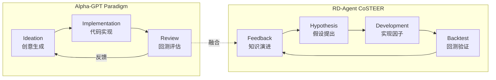
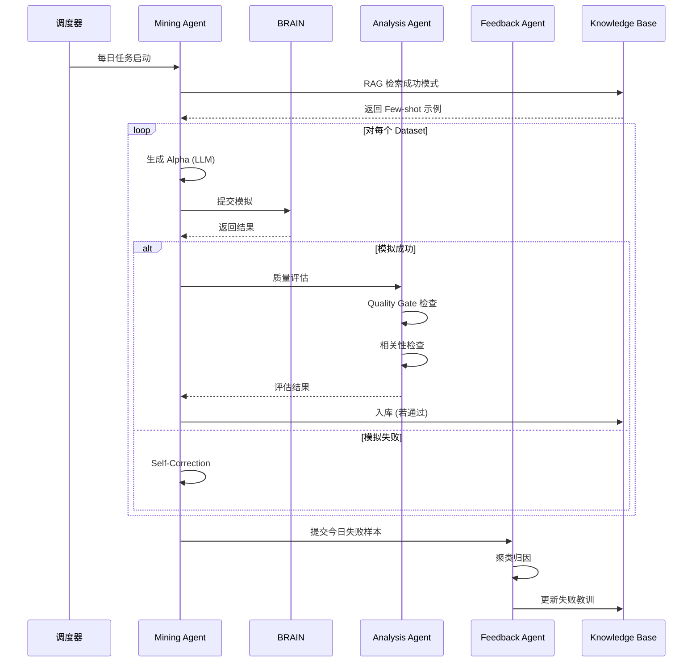

# AIAC 2.0 (AIACV2): 基于 Alpha-GPT 的持续多样性 Alpha 挖掘系统 —— 需求说明文档

**版本**：v2.0  
**日期**：2026-01-24  
**状态**：正式版  
**理论基础**：Alpha-GPT 1.0/2.0 + RD-Agent CoSTEER

---

## 1. 背景与目标

### 1.1 背景

当前项目已具备基本 Alpha 挖掘链路（LLM 生成 → 模拟 → 入库）。用户希望基于 **Alpha-GPT** (Human-in-the-Loop AI) 与 **RD-Agent** (CoSTEER 反馈闭环) 的理念，实现"持续挖掘多样性 Alpha"的智能化工厂。

### 1.2 总目标 (North Star)

构建一个 **人机协作的 Alpha 挖掘工厂**，实现：

| 目标 | 关键指标 | 实现方式 |
|------|---------|---------|
| **稳定产出** | 每日 3-4 个合格 Alpha | 自动化挖掘引擎 + 质量门槛 |
| **持续多样性** | 跨区域、跨数据集探索 | Hierarchical RAG + 多样性约束 |
| **全链路可视化** | Trace 步骤 100% 可追溯 | Web UI + Trace 记录 |
| **反馈闭环** | 失败教训自动转化为规则 | CoSTEER 双循环机制 |

### 1.3 核心设计理念



**Multi-Agent 架构**：

| Agent | 职责 | Alpha-GPT 对应 | RD-Agent 对应 |
|-------|------|---------------|--------------|
| **Mining Agent** | 数据探索 + 表达式生成 | Alpha Mining Layer | Research (R) |
| **Analysis Agent** | 质量评估 + 相关性检查 | Alpha Analysis Layer | Evaluation |
| **Feedback Agent** | 失败归因 + 知识更新 | — | Development (D) |

---

## 2. 术语与定义

| 术语 | 定义 |
|------|------|
| **Alpha-GPT Protocol** | 人机交互协议，明确 Intent → Task 转化 |
| **Trace** | 一个 Alpha 从创意到入库的完整步骤记录 (RD-Agent 概念) |
| **CoSTEER** | Collaborative Evolving Strategy，协作演进策略 (RD-Agent 核心) |
| **Quality Gate** | 质量门槛：硬性 (Sharpe, Turnover) + 软性 (解释性) |
| **Diversity Score** | 新 Alpha 与历史库的差异度评分 |
| **Knowledge Base** | 系统长期记忆：成功模式 + 失败教训 + 元数据 |
| **Hierarchical RAG** | 分层检索增强生成 (Category → Subcategory → Field) |

---

## 3. 现状与目标对比

| 维度 | 当前现状 (As-Is) | 目标状态 (To-Be) |
|------|-----------------|-----------------|
| **交互模式** | 脚本/命令行 | Web UI 可视化交互 + Trace 追踪 |
| **挖掘策略** | 固定 Region/Dataset | Hierarchical RAG 自动探索 |
| **反馈机制** | 无 (黑盒) | CoSTEER 双循环 (短期自修正 + 长期演进) |
| **知识管理** | 无 | Knowledge Base (成功/失败/元数据) |
| **可观测性** | 日志文件 | 实时 Dashboard + 步骤 Trace |
| **人工干预** | 不支持 | 任意步骤可暂停/调整/跳过 |

---

## 4. 功能需求

### 4.1 核心功能模块

#### 4.1.1 自动化挖掘引擎 (Mining Engine)

- **Hierarchical RAG 探索** (Alpha-GPT 1.0)
  - Level 1: 高层类别 (Price-Volume, Sentiment, Fundamental)
  - Level 2: 子类别 (Earnings, Options, News)
  - Level 3: 具体字段 (eps_surprise, implied_volatility)
- **预算管理**: 每日 Token + 模拟次数预算
- **规则守门**: 语法校验、字段校验、算子黑白名单

#### 4.1.2 反馈闭环系统 (CoSTEER Loop)

**短循环 (Single Task)**:
```
生成 Alpha → 模拟 → 失败 → Self-Correction → 重新生成
```

**长循环 (Cross-Task)**:
```
失败样本 → 聚类归因 → 更新 Knowledge Base → 优化 Prompt Template
```

**Knowledge Base 结构**:
- `success_patterns`: 高效组合模式
- `failure_pitfalls`: 错误陷阱
- `field_blacklist`: 字段黑名单
- `operator_stats`: 算子统计

#### 4.1.3 Web UI 可视化平台

| 页面 | 功能 |
|------|------|
| **Dashboard** | 每日概览、实时活动流、KPI 卡片 |
| **Task Management** | 任务创建、Trace 可视化、人工干预 |
| **Alpha Lab** | 表达式详情、性能图表、人工反馈 |
| **Config Center** | 质量门槛、算子偏好、知识库管理 |

**Trace 可视化** (核心需求):
- Step 1: RAG 检索 → 显示引用知识
- Step 2: 假设生成 → 显示 CoT 推理
- Step 3: 表达式生成 → 语法高亮
- Step 4: 模拟结果 → 成功/失败 + JSON
- Step 5: 自我修正 → Diff 对比

### 4.2 业务流程



---

## 5. 非功能需求

| 类别 | 要求 |
|------|------|
| **可扩展性** | 支持接入多种 LLM (DeepSeek, GPT-4, Claude) |
| **响应速度** | UI 操作 < 200ms，模拟结果异步加载 |
| **数据安全** | API Key 加密，本地备份 |
| **工程规范** | Modular Monolith 架构，前后端分离 |

---

## 6. 交付物清单

1. **需求说明文档 (本文)**
2. **详细设计文档** (架构 + DB + API)
3. **源代码** (Backend: FastAPI + Frontend: React)
4. **部署与运维手册**
